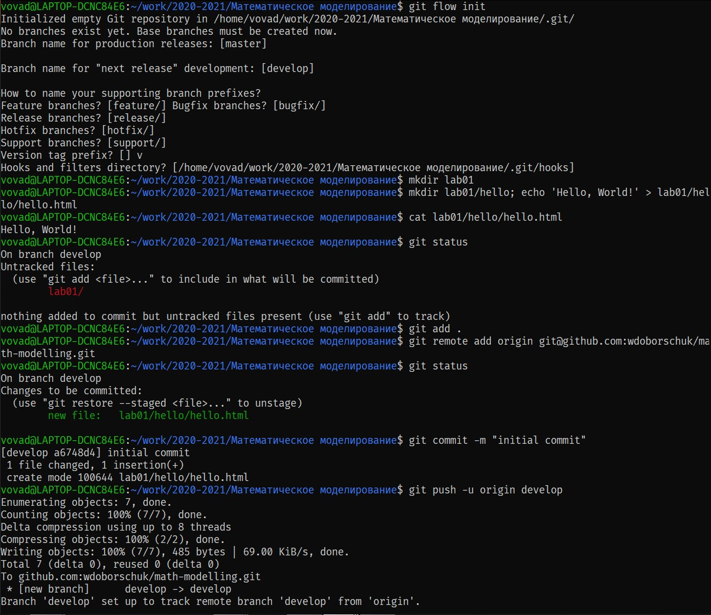
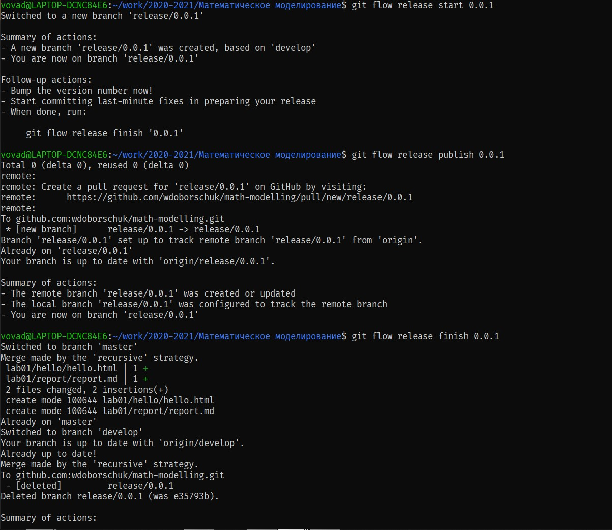
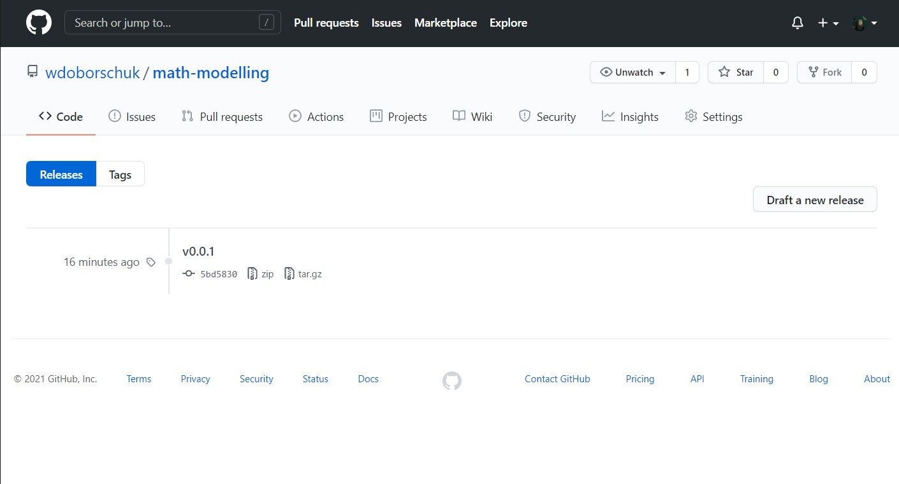

---
## Front matter
title: "Лабораторная работа №1: Работа с Git. Создание отчётов в Markdown"
subtitle: "*дисциплина: Математическое моделирование*"
author: "Доборщук Владимир Владимирович, НФИбд-01-18"

## Formatting
toc: false
slide_level: 2
theme: metropolis
mainfont: PT Serif
romanfont: PT Serif
sansfont: PT Sans
monofont: Fira Code
header-includes:
 - \metroset{progressbar=frametitle,sectionpage=progressbar,numbering=fraction}
 - '\makeatletter'
 - '\beamer@ignorenonframefalse'
 - '\makeatother'
aspectratio: 43
section-titles: true

---

# Введение

## Цель и задачи работы

**Цель** 

Изучить возможности системы контроля версий Git, а также применить методологию Git Flow при реализации лабораторной работы. 

**Задачи**

- создать локальный git-репозиторий на основе задания к лабораторной работе
- синхронизировать локальный репозиторий с удаленным на Github
- создать и опубликовать релиз

# Терминология. Условные обозначения

**Git** - это распределенная СКР с открытым исходным кодом.

[**GitHub**](https://github.com) - платформа-хостинг для ведения и разработки проектов.

**Git Flow** — методология ведения проектов, а также предоставляемый модуль `git-flow` для упрощенной работы по этой методологии в Git.

# Выполение лабораторной работы

## Установка git и git-flow

На дисциплине "Научное программирование" ранее был создан аккаунт и настроено окружение Git. Для установки в среде Unix будут работать следующие инструкции:

```sh
sudo apt install git
sudo apt install git-flow
```

## Синхронизация с Github

- Генерация SSH-ключа и его добавление на GitHub (`ssh-keygen -t rsa`).

- Создание локального репозитория и простого файла.

- Инициализация git (с помощью `git flow init`) и привязка репозитория на GitHub.

## Синхронизация с Github



## Создание `feature`


## Создание `release`



## Создание `release`



# Выводы

Выполнив данную лабораторную работы, мы:

- повторили опыт работы с системой контроля версий Git
- изучили методологию Git Flow
- грамотно синхронизировали работу с Github

## Сcылки на ресурсы

YouTube видео-отчёт: [https://www.youtube.com/watch?v=pHm37x9osmw](https://www.youtube.com/watch?v=pHm37x9osmw)

Ссылка на репозиторий с файлами работы: [https://github.com/wdoborschuk/math-modelling](https://github.com/wdoborschuk/math-modelling)
