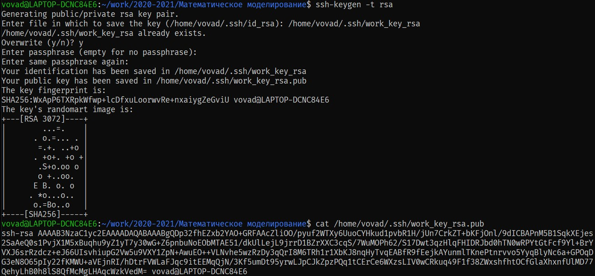
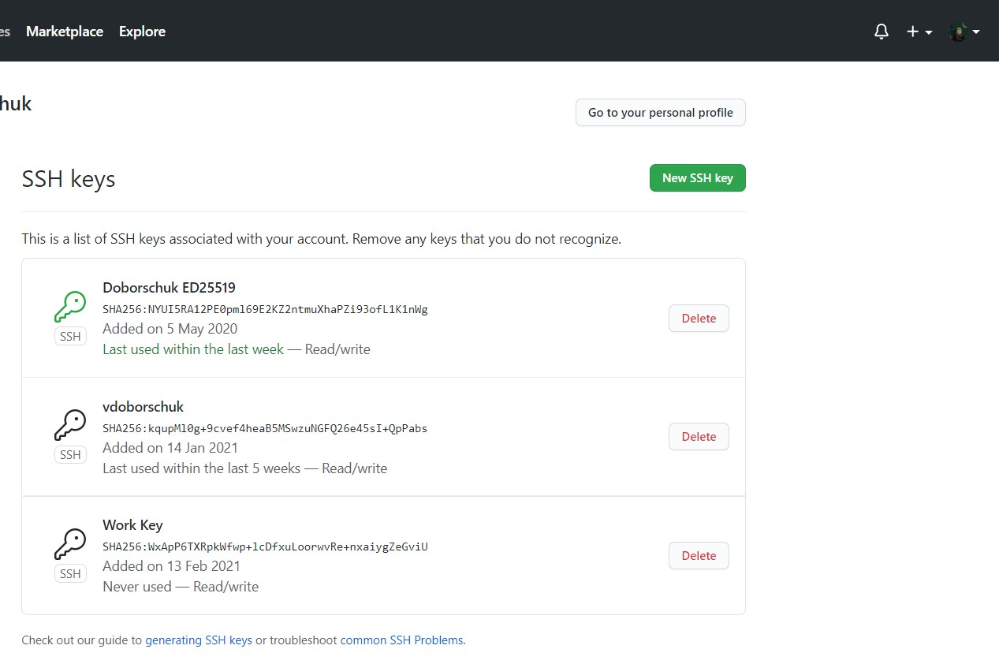
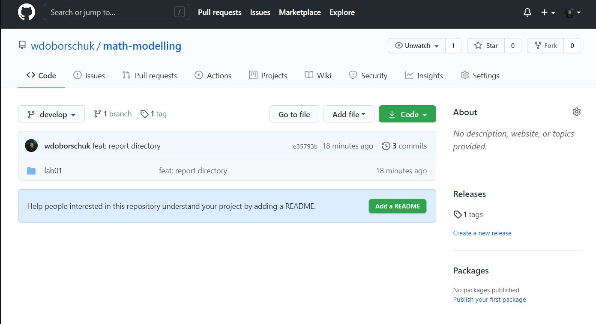

---
# Front matter
lang: ru-RU
title: "Лабораторная работа №1"
subtitle: "Работа с Git. Создание отчётов в Markdown"
author: "Доборщук Владимир Владимирович (c/б 1032186063)"

# Formatting
toc-title: "Содержание"
toc: true # Table of contents
toc_depth: 2
lof: true # List of figures
fontsize: 12pt
linestretch: 1.5
papersize: a4paper
documentclass: scrreprt
mainfont: PT Serif
romanfont: PT Serif
sansfont: PT Sans
monofont: Fira Code
mainfontoptions: Ligatures=TeX
romanfontoptions: Ligatures=TeX
sansfontoptions: Ligatures=TeX,Scale=MatchLowercase
monofontoptions: Scale=MatchLowercase
indent: true
pdf-engine: xelatex
header-includes:
  - \linepenalty=10 # the penalty added to the badness of each line within a paragraph (no associated penalty node) Increasing the value makes tex try to have fewer lines in the paragraph.
  - \interlinepenalty=0 # value of the penalty (node) added after each line of a paragraph.
  - \hyphenpenalty=50 # the penalty for line breaking at an automatically inserted hyphen
  - \exhyphenpenalty=50 # the penalty for line breaking at an explicit hyphen
  - \binoppenalty=700 # the penalty for breaking a line at a binary operator
  - \relpenalty=500 # the penalty for breaking a line at a relation
  - \clubpenalty=150 # extra penalty for breaking after first line of a paragraph
  - \widowpenalty=150 # extra penalty for breaking before last line of a paragraph
  - \displaywidowpenalty=50 # extra penalty for breaking before last line before a display math
  - \brokenpenalty=100 # extra penalty for page breaking after a hyphenated line
  - \predisplaypenalty=10000 # penalty for breaking before a display
  - \postdisplaypenalty=0 # penalty for breaking after a display
  - \floatingpenalty = 20000 # penalty for splitting an insertion (can only be split footnote in standard LaTeX)
  - \raggedbottom # or \flushbottom
  - \usepackage{float} # keep figures where there are in the text
  - \floatplacement{figure}{H} # keep figures where there are in the text
---

# Цель работы

Изучить возможности системы контроля версий Git, а также применить методологию Git Flow при реализации лабораторной работы.

# Задание

- создать локальный git-репозиторий на основе задания к лабораторной работе
- синхронизировать локальный репозиторий с удаленным на Github
- создать и опубликовать релиз

# Выполнение лабораторной работы

## Github. Добавление SSH-ключа

На дисциплине "Научное программирование" ранее был создан аккаунт, поэтому просто добавим новый ключ для работы.

С помощью команды `ssh-keygen -t rsa` сгенерируем новый ключ, после чего скопируем его на Github (рис. -@fig:001 и рис. -@fig:002).

{ #fig:001 width=80% }

{ #fig:002 width=80% }

## Инициализация локального репозитория

С помощью предустановленного `git flow`, инициализируем новый репозиторий. Добавим рабочую директорию `hello` и создадим в ней файл `hello.html`, со следующим содержимым:

```html
Hello, World!
```

Далее мы выгрузим в ветку `develop` имеющиеся в директориях файлы, предварительно создав репозиторий `math-modelling` на Github для дальнейшей выгрузки туда. Так как у нас подключен ssh-ключ, нам не потребуется ввод логина и пароля от нашего аккаунта (рис. -@fig:003).

{ #fig:003 width=80% }

## Создание `feature`

Далее мы создаем с помощью `git flow feature start FEATURE_NAME` новую фичу, в работе над которой мы создадим директорию для дальнейшего хранения отчёта (рис. -@fig:004).

{ #fig:004 width=80% }

Для выгрузки итоговых изменений в Github, пользуемся следующей командой:

```sh
git push
```

## Создание `release`

Предварительно настроив Git Flow во время инициализации локального репозитория, мы создадим предварительный релиз для нашей лабораторной работы под версией `0.0.1` (рис. -@fig:005).

{ #fig:005 width=80% }

Для того, чтобы увидеть изменения на Github, пропишем следующую команду в консоли:

```sh
git push --tags
```

Проверим внесенные нами изменения на Github, где убедимся в успешной выгрузке наших изменений (рис. -@fig:006 и рис. -@fig:007)

{ #fig:006 width=80% }

{ #fig:007 width=80% }

# Выводы

Выполнив данную лабораторную работы, мы:

- повторили опыт работы с системой контроля версий Git
- изучили методологию Git Flow
- грамотно синхронизировали работу с Github

Ссылки:

- YouTube видео-отчёт: [https://www.youtube.com/watch?v=pHm37x9osmw](https://www.youtube.com/watch?v=pHm37x9osmw)
- Github: [https://github.com/wdoborschuk/math-modelling](https://github.com/wdoborschuk/math-modelling)