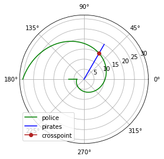

---
title: "Лабораторная работа №2. Задача о погоне"
author: [Доборщук Владимир Владимирович]
institute: "RUDN University, Moscow, Russian Federation"
date: "27 марта 2021"
subtitle: "c/б 1032186063 | НФИбд-01-18"
keywords: [Моделирование, Лабораторная]
lang: "ru"
toc-title: "Содержание"
toc: true # Table of contents
toc_depth: 2
lof: true # List of figures
fontsize: 12pt
mainfont: PT Serif
romanfont: PT Serif
sansfont: PT Sans
monofont: Fira Sans
mainfontoptions: Ligatures=TeX
romanfontoptions: Ligatures=TeX
sansfontoptions: Ligatures=TeX,Scale=MatchLowercase
monofontoptions: Scale=MatchLowercase
titlepage: true
titlepage-text-color: "000000"
titlepage-rule-color: "1A1B35"
titlepage-rule-height: 2
listings-no-page-break: true
indent: true
header-includes:
  - \usepackage{sectsty}
  - \sectionfont{\clearpage}
  - \linepenalty=10 # the penalty added to the badness of each line within a paragraph (no associated penalty node) Increasing the value makes tex try to have fewer lines in the paragraph.
  - \interlinepenalty=0 # value of the penalty (node) added after each line of a paragraph.
  - \hyphenpenalty=50 # the penalty for line breaking at an automatically inserted hyphen
  - \exhyphenpenalty=50 # the penalty for line breaking at an explicit hyphen
  - \binoppenalty=700 # the penalty for breaking a line at a binary operator
  - \relpenalty=500 # the penalty for breaking a line at a relation
  - \clubpenalty=150 # extra penalty for breaking after first line of a paragraph
  - \widowpenalty=150 # extra penalty for breaking before last line of a paragraph
  - \displaywidowpenalty=50 # extra penalty for breaking before last line before a display math
  - \brokenpenalty=100 # extra penalty for page breaking after a hyphenated line
  - \predisplaypenalty=10000 # penalty for breaking before a display
  - \postdisplaypenalty=0 # penalty for breaking after a display
  - \floatingpenalty = 20000 # penalty for splitting an insertion (can only be split footnote in standard LaTeX)
  - \raggedbottom # or \flushbottom
  - \usepackage{float} # keep figures where there are in the text
  - \floatplacement{figure}{H} # keep figures where there are in the text
...

# Цели и задачи

**Цель:** изучить задачу о погоне, а также реализовать её модель программно.

**Задачи:**

* изучить теорию о задаче о погоне
* построить модель для 2 случаев траектории движения

# Программная реализация

## Подготовка к моделированию

Все данные соответствуют варианту 14 = $(1032186063\mod{70}) + 1$.

**Инициализация библиотек**


```python
import math
import numpy as np
from scipy.integrate import odeint
import matplotlib.pyplot as plt
```

**Начальные данные и необходимые функции**


```python
k=7.5
n=3.1

fi=math.pi/3
x1=k/(n+1)

r0=x1
tetha0=0
tetha=np.arange(tetha0, 2*math.pi, 0.001)

t=np.arange(0,6.284,0.001)
t1=np.arange(r0, k, 0.01)
```

Объявим необходимые функции, исходя из данной нам информации в теоретической справке.


```python
def dr(r,tetha):
    dr = r/math.sqrt(n*n-1)
    return dr

def f2(t):
    xt=math.tan(fi+math.pi)*t
    return xt

def f3(t1):
    xt=math.tan(tetha0)*t1
    return xt

def cart2pol(x,y):
    rho = np.sqrt(x**2 + y**2)
    phi = np.arctan2(y, x)
    return rho, phi
```

Заложим в переменные решения для наших СДУ с помощью функции `odeint` модуля `scipy.integrate`, а также найдём точку пересечения траекторий.

## Построение графиков

### Модель первого типа


```python
r=odeint(dr,r0,tetha)
r1, tetha1 = cart2pol(t, f2(t))
r2, tetha2 = cart2pol(t1, f3(t1))

for i in range(len(tetha)):
    if abs(tetha1[i]-tetha[i]) <= 0.001:
        r_ins = tetha[i]
        tetha_ins = r[i][0]

plt.polar(tetha,r,'g')
plt.polar(tetha2, r2, 'g')
plt.polar(tetha1,r1,'b')
plt.polar(r_ins, tetha_ins, color='firebrick', marker='o', label='crosspoint')
plt.legend(loc='lower left')

print('crosspoint: r='+str(r_ins)+', tetha='+ str(tetha_ins))
```

`output: crosspoint: r=1.048, tetha=2.6145016420772618`


    

    


### Модель второго типа


```python
x2 = k/(n-1)
r0 = x2

tetha0 = -math.pi
tetha = np.arange(tetha0, -tetha0, 0.001)
r=odeint(dr,r0,tetha)
```


```python
t1=np.arange(-k, -r0, 0.01)
t=np.arange(0,10,0.001)
```


```python
r1, tetha1 = cart2pol(t, f2(t))
r2, tetha2 = cart2pol(t1, f3(t1))

for i in range(len(tetha)):
    if abs(tetha1[i]-tetha[i]) <= 0.001:
        r_ins = tetha[i]
        tetha_ins = r[i][0]

plt.polar(tetha,r,'g', label='police')
plt.polar(tetha2, r2, 'g')
plt.polar(tetha1,r1,'b', label='pirates')
plt.polar(r_ins, tetha_ins, color='firebrick', marker='o', label='crosspoint')
plt.legend(loc='lower left')

print('crosspoint: r='+str(r_ins)+', tetha='+ str(tetha_ins))
```

`output: crosspoint: r=1.047407346409745, tetha=14.888261569723666`


    

    


# Выводы

Мы изучили теорию о задаче о погоне, а также успешно реализовали 2 модели для решения этой задачи.