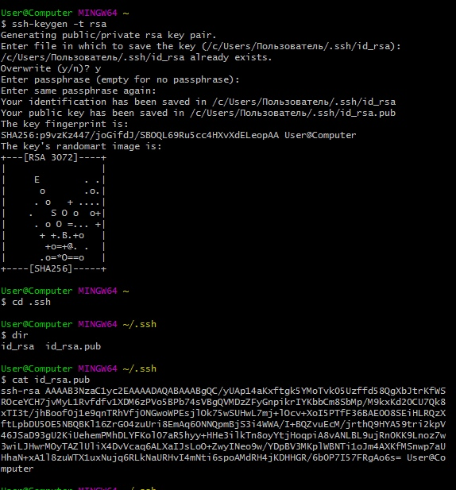
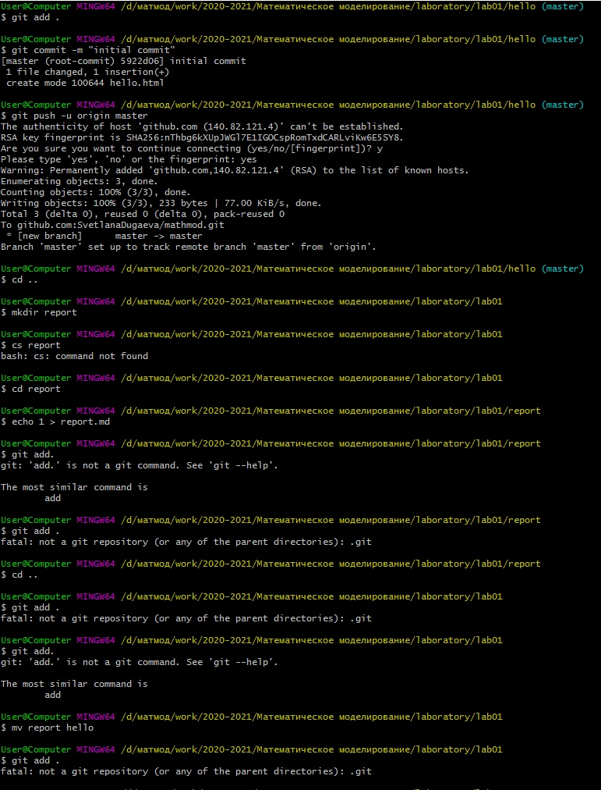
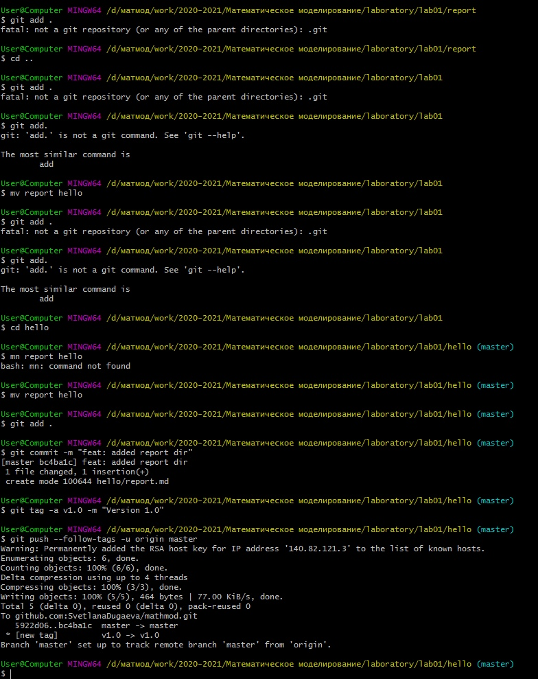

---
# Front matter
lang: ru-RU
title: "Лабораторная работа №1"
subtitle: "Работа с Git"
author: "Дугаева Светлана Анатольевна"

# Formatting
toc-title: "Содержание"
toc: true # Table of contents
toc_depth: 2
lof: true # List of figures
fontsize: 12pt
linestretch: 1.5
papersize: a4paper
documentclass: scrreprt
mainfont: PT Serif
romanfont: PT Serif
sansfont: PT Sans
monofont: Fira Code
mainfontoptions: Ligatures=TeX
romanfontoptions: Ligatures=TeX
sansfontoptions: Ligatures=TeX,Scale=MatchLowercase
monofontoptions: Scale=MatchLowercase
indent: true
pdf-engine: xelatex
header-includes:
  - \linepenalty=10 # the penalty added to the badness of each line within a paragraph (no associated penalty node) Increasing the value makes tex try to have fewer lines in the paragraph.
  - \interlinepenalty=0 # value of the penalty (node) added after each line of a paragraph.
  - \hyphenpenalty=50 # the penalty for line breaking at an automatically inserted hyphen
  - \exhyphenpenalty=50 # the penalty for line breaking at an explicit hyphen
  - \binoppenalty=700 # the penalty for breaking a line at a binary operator
  - \relpenalty=500 # the penalty for breaking a line at a relation
  - \clubpenalty=150 # extra penalty for breaking after first line of a paragraph
  - \widowpenalty=150 # extra penalty for breaking before last line of a paragraph
  - \displaywidowpenalty=50 # extra penalty for breaking before last line before a display math
  - \brokenpenalty=100 # extra penalty for page breaking after a hyphenated line
  - \predisplaypenalty=10000 # penalty for breaking before a display
  - \postdisplaypenalty=0 # penalty for breaking after a display
  - \floatingpenalty = 20000 # penalty for splitting an insertion (can only be split footnote in standard LaTeX)
  - \raggedbottom # or \flushbottom
  - \usepackage{float} # keep figures where there are in the text
  - \floatplacement{figure}{H} # keep figures where there are in the text
---

# Цель работы

Изучить возможности системы контроля версий Git, а также применить методологию Git Flow при реализации лабораторной работы.

# Задание

- создать локальный git-репозиторий на основе задания к лабораторной работе
- синхронизировать локальный репозиторий с удаленным на Github
- создать и опубликовать релиз

# Выполнение лабораторной работы

## Добавление SSH-ключа

С помощью команды `ssh-keygen -t rsa` генерируем новый ключ, после чего скопируем его на Github (рис. -@fig:001).

{ #fig:001 width=80% }

## Инициализация локального репозитория

С помощью `git init`, инициализируем новый репозиторий. Добавим рабочую директорию `hello` и создадим в ней файл `hello.html`, со следующим содержимым:

```html
Hello, World!
```

Далее, следующим набором комманд выгружаем изменения:

```sh
git add .
git commit -m "initial commit"
git push -u origin master
```

{ #fig:002 width=80% }

## Создание `release`

С помощью встроенных команд в git выгрузили релиз. 

{ #fig:003 width=80% }

Внесенные изменения можно увидеть на Githbub.

# Выводы

Выполнив данную лабораторную работы, мы:

- повторили опыт работы с системой контроля версий Git
- изучили методологию Git Flow
- грамотно синхронизировали работу с Github
