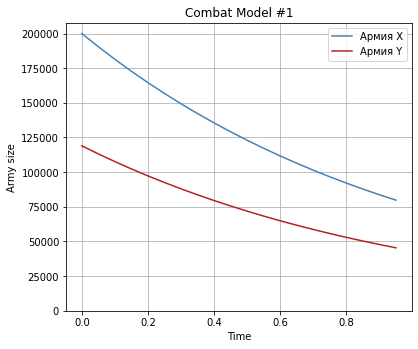
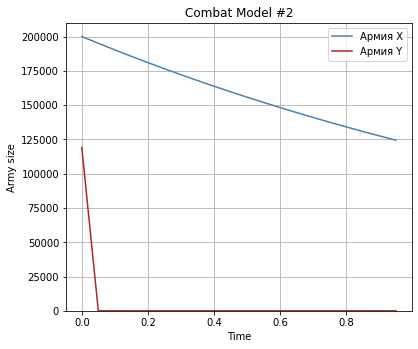

---
## Front matter
title: Лабораторная работа №3. Модель боевых действий
author: [Доборщук Владимир Владимирович]
institute: "RUDN University, Moscow, Russian Federation"
subtitle: "c/б 1032186063 | НФИбд-01-18"
date: 27 февраля 2021
lang: "ru"
## Formatting
toc: false
slide_level: 2
theme: metropolis
mainfont: PT Serif
romanfont: PT Serif
sansfont: PT Sans
monofont: Fira Sans
header-includes:
 - \metroset{progressbar=frametitle,sectionpage=progressbar,numbering=fraction}
 - '\makeatletter'
 - '\beamer@ignorenonframefalse'
 - '\makeatother'
aspectratio: 43
section-titles: true

---
# Цели и задачи

## Цель

Изучить модель боевых действий, её интерпретации, а также реализовать её в виде программного кода.

## Задачи

- изучить теорию о модели боевых действий
  * только между регулярными войсками
  * между регулярными войсками и партизанскими отрядами
  * только между партизанскими отрядами
- реализовать программный код на Python
  * модель ведения боевых действий между регулярными войсками
  * модель ведения боевых действий между регулярными войсками и партизанскими отрядами

# Ход выполнения лабораторной работы

## Начальные данные

**Вариант 14**: $1032186063 \mod 70 + 1 = 14$

$x_0$ = 200000 - численность армии $X$

$y_0$ = 119000 - численность армии $Y$

## Программная реализация

Формируем начальные значения:

```python
x0 = 200000
y0 = 119000
t0 = 0 

tmax = 1
dt = 0.05

t = np.arange(t0,tmax,dt)

v0 = np.array([x0, y0])
```

## Программная реализация

Также предварительно определим функцию для построения графиков:

```python
def army_model(time, data, num):
    title = 'Combat Model #' + num 
    plt.plot(time, data[0], 'steelblue', label='Армия X') 
    plt.plot(time, data[1], 'firebrick', label='Армия Y')
    plt.title(title)
    plt.xlabel('Time')
    plt.ylabel('Army size')
    plt.ylim(0, None)
    plt.legend()
    plt.grid(True)
    plt.margins(0.05)
    plt.subplots_adjust(left=0, bottom=0, right=0.8, top=1)
```

## Первая интепретация модели

**Ведение боевых действий между регулярными войсками**

$$ \begin{cases}
\frac{dx}{dt} = -a(t)x(t)-b(t)y(t)+P(t)
\\
\frac{dy}{dt} = -c(t)x(t)-h(t)y(t)+Q(t)
\end{cases}
$$

$a=0.5, h=0.8$ - потери от побочных факторов (болезнь, дезертирство и т.д.)

$b=0.8, c=0.7$ - потери во время хода боевых действий

$P(t)=\sin{t+5}+1,\quad Q(t)=\cos{t+3}+1$ - функции, определяющие подход подкрепления

## Программная реализация (первая модель)

Введём необходимые коэффициенты для модели боевых действий между регулярными войсками.

```python
a = 0.5
b = 0.8
c = 0.7
h = 0.8
```

## Программная реализация (первая модель)

Далее, необходимо определить функции $P(t)$ и $Q(t)$, а также необходимую нам функцию для СДУ.

```python
# possibility of reinforcement approach for X
def P1(t):
    p = sin(t+5) + 1
    return p

# possibility of reinforcement approach for Y
def Q1(t):
    q = cos(t+3) + 1
    return q

# system of differential equations function
def dy1(y,t):
    dy_1 = -a*y[0] - b*y[1] + P1(t)
    dy_2 = -c*y[0] - h*y[1] + Q1(t)
    return [dy_1, dy_2]
```

## Программная реализация (первая модель)

Далее, решим систему дифференциальных уравнений с помощью функции `odeint` и построим модель графически.

```python
y = odeint(dy1, v0, t)
army_data = [[elem[0] for elem in y], [elem[1] for elem in y]]

army_model(t, army_data, str(1))
```

## График первой модели

Можем наблюдать параллельное и равномерное снижение численности обеих армий (рис. 1).

{ #fig:001 width=60% }

## Вторая интерпретация модели

$$ \begin{cases}
\frac{dx}{dt}= -a(t)x(t)-b(t)y(t)+P(t)
\\
\frac{dy}{dt}= -c(t)x(t)y(t)-h(t)y(t)+Q(t)
\end{cases}
$$

$a=0.5, h=0.5$

$b=0.8, c=0.3$

$P(t)=\sin{10t},\quad Q(t)=\cos{10t}$

## Программная реализация (вторая модель)

Переопределим коэфициенты для модели ведения боевых действий с участием регулярных войск и партизанских отрядов.

```python
a = 0.5
b = 0.8
c = 0.3
h = 0.5
```

## Программная реализация (вторая модель)

Также переопределим функции $P(t)$ и $Q(t)$, модифицируем для данной модели СДУ.

```python
# possibility of reinforcement approach for X
def P2(t):
    p = sin(10*t)
    return p

# possibility of reinforcement approach for Y
def Q2(t):
    q = cos(10*t)
    return q

# system of differential equations function
def dy2(y,t):
    dy_1 = -a*y[0] - b*y[1] + P2(t)
    dy_2 = -c*y[0]*y[1] - h*y[1] + Q2(t)
    return [dy_1, dy_2]
```

## Программная реализация (вторая модель)

Повторно решим нашу СДУ при новых условиях.

```python
y = odeint(dy2, v0, t)
army_data = [[elem[0] for elem in y], [elem[1] for elem in y]]

army_model(t, army_data, str(2))
```

## График второй модели

Получнный результат говорит о стремительных потерях армией $Y$ при реализации данной интерпретации модели боевых действий (рис.2).

{ #fig:002 width=60% }

# Выводы

Была изучена модель боевых действий, её интерпретации, а также её реализация в виде программного кода.

По построенным моделям можно судить, что при участии партизанских отрядов, армия Y будет иметь намного меньше возможностей для сдерживании армии X, но и при их отсутствии она будет сокрушена за отведенный промежуток времени или ранее.
