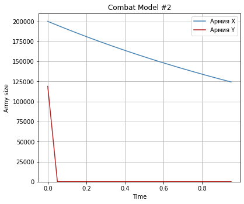

---
title: "Лабораторная работа №3. Модель боевых действий"
author: [Доборщук Владимир Владимирович]
institute: "RUDN University, Moscow, Russian Federation"
date: "27 февраля 2021"
subtitle: "c/б 1032186063 | НФИбд-01-18"
keywords: [Моделирование, Лабораторная]
lang: "ru"
toc-title: "Содержание"
toc: true # Table of contents
toc_depth: 2
lof: true # List of figures
fontsize: 12pt
mainfont: PT Serif
romanfont: PT Serif
sansfont: PT Sans
monofont: Fira Sans
mainfontoptions: Ligatures=TeX
romanfontoptions: Ligatures=TeX
sansfontoptions: Ligatures=TeX,Scale=MatchLowercase
monofontoptions: Scale=MatchLowercase
titlepage: true
titlepage-text-color: "000000"
titlepage-rule-color: "1A1B35"
titlepage-rule-height: 2
listings-no-page-break: true
indent: true
header-includes:
  - \usepackage{sectsty}
  - \sectionfont{\clearpage}
  - \linepenalty=10 # the penalty added to the badness of each line within a paragraph (no associated penalty node) Increasing the value makes tex try to have fewer lines in the paragraph.
  - \interlinepenalty=0 # value of the penalty (node) added after each line of a paragraph.
  - \hyphenpenalty=50 # the penalty for line breaking at an automatically inserted hyphen
  - \exhyphenpenalty=50 # the penalty for line breaking at an explicit hyphen
  - \binoppenalty=700 # the penalty for breaking a line at a binary operator
  - \relpenalty=500 # the penalty for breaking a line at a relation
  - \clubpenalty=150 # extra penalty for breaking after first line of a paragraph
  - \widowpenalty=150 # extra penalty for breaking before last line of a paragraph
  - \displaywidowpenalty=50 # extra penalty for breaking before last line before a display math
  - \brokenpenalty=100 # extra penalty for page breaking after a hyphenated line
  - \predisplaypenalty=10000 # penalty for breaking before a display
  - \postdisplaypenalty=0 # penalty for breaking after a display
  - \floatingpenalty = 20000 # penalty for splitting an insertion (can only be split footnote in standard LaTeX)
  - \raggedbottom # or \flushbottom
  - \usepackage{float} # keep figures where there are in the text
  - \floatplacement{figure}{H} # keep figures where there are in the text
...

# Цели и задачи

**Цель:** Изучить модель боевых действий, её интерпретации, а также реализовать её в виде программного кода.

**Задачи:**

- изучить теорию о модели боевых действий
  * только между регулярными войсками
  * между регулярными войсками и партизанскими отрядами
  * только между партизанскими отрядами
- реализовать программный код на Python
  * модель ведения боевых действий между регулярными войсками
  * модель ведения боевых действий между регулярными войсками и партизанскими отрядами

# Теоретическая справка

## Боевые действия между регулярными войсками

$$ \begin{cases}
\frac{dx}{dt} =  -a(t)x(t) - b(t)y(t)+P(t)
\\
\frac{dy}{dt} =  -c(t)x(t) - h(t)y(t)+Q(t)
\end{cases},
$$

где $a(t)$ и $h(t)$ описывают влияние дополнительных факторов на потери (болезнь, дезертирство и тому подобное), а $b(t)$ и $c(t)$ - коэффициенты эффективности ведения боевых действий соответственно для войск $Y$ и $X$.

## Боевые действия между регулярными войсками и партизанскими отрядами

Нерегулярные войска в отличии от постоянной армии менее уязвимы, так как действуют скрытно, в этом случае сопернику приходится действовать неизбирательно, по площадям, занимаемым партизанами. Поэтому считается, что темп потерь партизан, проводящих свои операции в разных местах на некоторой известной территории, пропорционален не только численности армейских соединений, но и численности самих партизан.

$$ \begin{cases}
\frac{dx}{dt} =  -a(t)x(t) - b(t)y(t)+P(t)
\\
\frac{dy}{dt} =  -c(t)x(t)y(t) - h(t)y(t)+Q(t)
\end{cases}
$$

## Боевые действия партизанских отрядов

С учётом вышеописанного, полная модель при участии партизанских отрядов будет иметь следующий вид:

$$ \begin{cases}
\frac{dx}{dt} =  -a(t)x(t) - b(t)x(t)y(t)+P(t)
\\
\frac{dy}{dt} =  -c(t)x(t)y(t) - h(t)y(t)+Q(t)
\end{cases}
$$

## Использование постоянных коэффициентов

Коэффициенты $a(t), b(t), c(t), h(t)$ будут постоянными при выполнении лабораторной работы, так как в альтернативном случае задача моделирования подобного процесса значительно усложняется.

# Программная реализация

## Инициализация начальных данных

Все данные соответствуют варианту 14 ($1032186063 \mod 70 + 1 = 14$)

**Инициализация библиотек**


```python
import numpy as np
from math import cos, sin
from scipy.integrate import odeint
import matplotlib.pyplot as plt
```

**Начальные данные**


```python
x0 = 200000
y0 = 119000
t0 = 0 

tmax = 1
dt = 0.05

t = np.arange(t0,tmax,dt)

v0 = np.array([x0, y0])
```

**Функция построения графиков**


```python
def army_model(time, data, num):
    title = 'Combat Model #' + num 
    plt.plot(time, data[0], 'steelblue', label='Армия X') 
    plt.plot(time, data[1], 'firebrick', label='Армия Y')
    plt.title(title)
    plt.xlabel('Time')
    plt.ylabel('Army size')
    plt.ylim(0, None)
    plt.legend()
    plt.grid(True)
    plt.margins(0.05)
    plt.subplots_adjust(left=0, bottom=0, right=0.8, top=1)
```

## Реализация моделей

### Модель боевых действий №1

Введём необходимые коэффициенты для модели боевых действий между регулярными войсками.


```python
a = 0.5
b = 0.8
c = 0.7
h = 0.8
```

Далее, необходимо определить функции $P(t)$ и $Q(t)$, а также необходимую нам функцию для системы дифференциальных уравнений.


```python
# possibility of reinforcement approach for X
def P1(t):
    p = sin(t+5) + 1
    return p

# possibility of reinforcement approach for Y
def Q1(t):
    q = cos(t+3) + 1
    return q

# system of differential equations function
def dy1(y,t):
    dy_1 = -a*y[0] - b*y[1] + P1(t)
    dy_2 = -c*y[0] - h*y[1] + Q1(t)
    return [dy_1, dy_2]
```

Далее, решим систему дифференциальных уравнений с помощью функции `odeint` и построим модель графически (рис. 1).


```python
y = odeint(dy1, v0, t)
army_data = [[elem[0] for elem in y], [elem[1] for elem in y]]

army_model(t, army_data, str(1))
```
    

    
### Модель боевых действий №2

Переопределим коэфициенты для модели ведения боевых действий с участием регулярных войск и партизанских отрядов.

```python
a = 0.5
b = 0.8
c = 0.3
h = 0.5
```

Также переопределим функции $P(t)$ и $Q(t)$, модифицируем для данной модели СДУ.


```python
# possibility of reinforcement approach for X
def P2(t):
    p = sin(10*t)
    return p

# possibility of reinforcement approach for Y
def Q2(t):
    q = cos(10*t)
    return q

# system of differential equations function
def dy2(y,t):
    dy_1 = -a*y[0] - b*y[1] + P2(t)
    dy_2 = -c*y[0]*y[1] - h*y[1] + Q2(t)
    return [dy_1, dy_2]
```

Повторно решим нашу СДУ при новых условиях (рис. 2).


```python
y = odeint(dy2, v0, t)
army_data = [[elem[0] for elem in y], [elem[1] for elem in y]]

army_model(t, army_data, str(2))
```


    
# Выводы

Была изучена модель боевых действий, её интерпретации, а также её реализация в виде программного кода.

По построенным моделям можно судить, что при участии партизанских отрядов, армия Y будет иметь намного меньше возможностей для сдерживании армии X, но и при их отсутствии она будет сокрушена за отведенный промежуток времени или ранее.