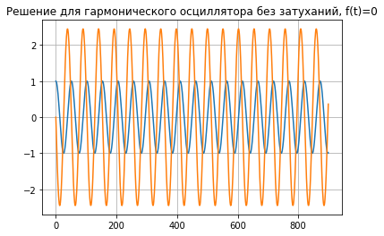
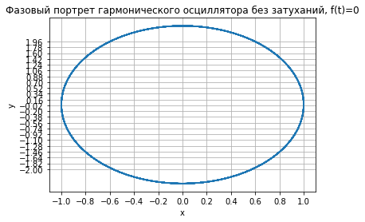
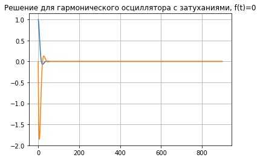
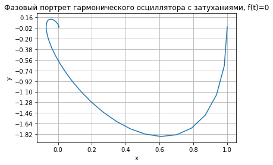
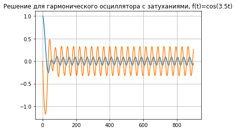
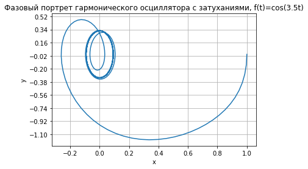

---
## Front matter
title: Лабораторная работа №4. Модель гармонических колебаний
author: [Доборщук Владимир Владимирович]
institute: "RUDN University, Moscow, Russian Federation"
subtitle: "c/б 1032186063 | НФИбд-01-18"
date: 6 марта 2021
lang: "ru"
## Formatting
toc: false
slide_level: 2
theme: metropolis
mainfont: PT Serif
romanfont: PT Serif
sansfont: PT Sans
monofont: Fira Sans
header-includes:
 - \metroset{progressbar=frametitle,sectionpage=progressbar,numbering=fraction}
 - '\makeatletter'
 - '\beamer@ignorenonframefalse'
 - '\makeatother'
aspectratio: 43
section-titles: true

---
# Цели и задачи

## Цель

Изучить модель гармонических колебаний и программно реализовать процесс моделирования гармонического осциллятора.

## Задачи

- изучить теорию о модели гармонических колебаний
- построить модели гармонического осцилятора (фазовый портрет и его решение) для 3 случаев:
  * без затуханий, без воздейтвия внешних сил
  * с затуханиями, без воздействия внешних сил
  * с затуханиями, с воздействием внешних сил

# Ход выполнения лабораторной работы

## Теоретическая справка

Уравнение свободных колебаний гармонического осциллятора имеет следующий вид:

$$
\ddot{x} + 2\gamma\dot{x} + \omega_0^2 x = 0
$$

где $x$ – переменная, описывающая состояние системы (смещение грузика, заряд конденсатора и т.д.), $\gamma$ – параметр, характеризующий потери энергии (трение в механической системе, сопротивление в контуре), $\omega_0$ – собственная частота колебаний, $t$ – время. (Обозначения $\ddot{x} = \frac{\partial^2 x}{\partial t^2}, \dot{x} = \frac{\partial x}{\partial t}$)

## Теоретическая справка

Для решения поставленной нами задачи мы будем использовать именно эту форму уравнения, предварительно перейдя к следующей системе:

$$
\begin{cases}
\dot{x} = y
\\
\dot{y} = -\omega_0^2x - 2\gamma\dot{x} + f(t) 
\end{cases}
$$

где $f(t)$ - функция воздействия внешних сил.

## Начальные данные

**Вариант 14**: $(1032186063\mod{70}) + 1$

$f_{1,2}(t)$ = 0

$\omega_{0_1} = \sqrt(6)$

$2\gamma_1 = 0$

$\omega_{0_2} = \sqrt(15)$

$2\gamma_2 = 5$

$f_3(t)=\cos{(3,5t)}$

$\omega_{0_3} = 2$

$2\gamma_2 = 2$

$x_0 = 1, y_0 = 0$


## Программная реализация

**Инициализация библиотек**

```python
import numpy as np
import matplotlib.pyplot as plt
from math import sin, cos
from scipy.integrate import odeint
```

## Программная реализация

Для успешной реализации модели нам потребуется $f(t)$ и начальные данные коэффициентов $\omega_0$ и $2\gamma$. Помимо этого, объявим функции для наших систем дифференциальных уравнений (с и без воздействия внешних сил).

## Программная реализация

```python
w = np.sqrt(6)
g = 0.00

def f0(t):
    value = sin(0.00*t)
    return value

def f1(t):
    value = cos(3.50*t)
    return value

def dx0(x,t):
    dx1 = x[1]
    dx2 = -w*w*x[0] - g*x[1] + f0(t)
    return [dx1, dx2]

def dx1(x,t):
    dx1 = x[1]
    dx2 = -w*w*x[0] - g*x[1] + f1(t)
    return [dx1, dx2]
```

## Программная реализация

Инициализируем начальные данные:

```python
t0 = 0
x0 = [1,0]
t = np.arange(t0, 45, 0.05)
```

## Программная реализация

Также объявим функции для построения решения и фазового портрета гармонического осциллятора. 


```python
def plot_solution(res, title):
    plt.grid()
    plt.title(title)
    plt.plot(res)

def plot_portrait(res, title):
    y1 = res[:,0]
    y2 = res[:,1]
    
    plt.grid()
    plt.title(title)
    plt.yticks(np.arange(-2,2,0.18))
    plt.xticks(np.arange(-2,2,0.2))
    plt.ylabel('y')
    plt.xlabel('x')
    plt.plot(y1, y2)
```

## Гармонический осциллятор без затухания, без воздействия внешних сил


```python
x = odeint(dx0, x0, t)
plot_solution(x, 'Решение для гармонического осциллятора без затуханий, f(t)=0')
```

## Гармонический осциллятор без затухания, без воздействия внешних сил

    
{ #fig:001 width=60% }

## Гармонический осциллятор без затухания, без воздействия внешних сил

```python
plot_portrait(x, 'Фазовый портрет гармонического осциллятора без затуханий, f(t)=0')
```

## Гармонический осциллятор без затухания, без воздействия внешних сил
    
{ #fig:002 width=60% }

## Гармонический осциллятор с затуханиями, без воздействия внешних сил


```python
w = np.sqrt(15)
g = 5.00

x = odeint(dx0, x0, t)
plot_solution(x, 'Решение для гармонического осциллятора с затуханиями, f(t)=0')
```

## Гармонический осциллятор с затуханиями, без воздействия внешних сил
    
{ #fig:003 width=60% }
    
## Гармонический осциллятор с затуханиями, без воздействия внешних сил


```python
plot_portrait(x, 'Фазовый портрет гармонического осциллятора с затуханиями, f(t)=0')
```

## Гармонический осциллятор с затуханиями, без воздействия внешних сил
    
{ #fig:004 width=60% }
    


## Гармонический осциллятор с затуханиями, с воздействием внешних сил


```python
w = 2
g = 2.00

x = odeint(dx1, x0, t)
plot_solution(x, 'Решение для гармонического осциллятора с затуханиями, f(t)=cos(3.5t)')
```

## Гармонический осциллятор с затуханиями, с воздействием внешних сил
    
{ #fig:005 width=60% }
    

## Гармонический осциллятор с затуханиями, с воздействием внешних сил

```python
plot_portrait(x, 'Фазовый портрет гармонического осциллятора с затуханиями, f(t)=cos(3.5t)')
```

## Гармонический осциллятор с затуханиями, с воздействием внешних сил
    
{ #fig:006 width=60% }


# Выводы

Мы изучили теорию о модели гармонических колебаний и программно реализовали процесс моделирования гармонического осциллятора, его фазового портрета и непосредственного решения. Все задачи можно считать выполненными успешно.