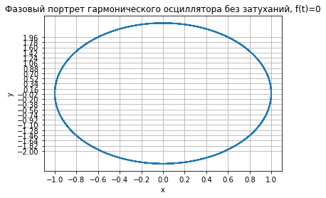
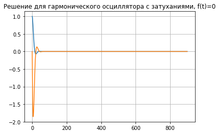

---
title: "Лабораторная работа №4. Модель гармонических колебаний"
author: [Доборщук Владимир Владимирович]
institute: "RUDN University, Moscow, Russian Federation"
date: "6 марта 2021"
subtitle: "c/б 1032186063 | НФИбд-01-18"
keywords: [Моделирование, Лабораторная]
lang: "ru"
toc-title: "Содержание"
toc: true # Table of contents
toc_depth: 2
lof: true # List of figures
fontsize: 12pt
mainfont: PT Serif
romanfont: PT Serif
sansfont: PT Sans
monofont: Fira Sans
mainfontoptions: Ligatures=TeX
romanfontoptions: Ligatures=TeX
sansfontoptions: Ligatures=TeX,Scale=MatchLowercase
monofontoptions: Scale=MatchLowercase
titlepage: true
titlepage-text-color: "000000"
titlepage-rule-color: "1A1B35"
titlepage-rule-height: 2
listings-no-page-break: true
indent: true
header-includes:
  - \usepackage{sectsty}
  - \sectionfont{\clearpage}
  - \linepenalty=10 # the penalty added to the badness of each line within a paragraph (no associated penalty node) Increasing the value makes tex try to have fewer lines in the paragraph.
  - \interlinepenalty=0 # value of the penalty (node) added after each line of a paragraph.
  - \hyphenpenalty=50 # the penalty for line breaking at an automatically inserted hyphen
  - \exhyphenpenalty=50 # the penalty for line breaking at an explicit hyphen
  - \binoppenalty=700 # the penalty for breaking a line at a binary operator
  - \relpenalty=500 # the penalty for breaking a line at a relation
  - \clubpenalty=150 # extra penalty for breaking after first line of a paragraph
  - \widowpenalty=150 # extra penalty for breaking before last line of a paragraph
  - \displaywidowpenalty=50 # extra penalty for breaking before last line before a display math
  - \brokenpenalty=100 # extra penalty for page breaking after a hyphenated line
  - \predisplaypenalty=10000 # penalty for breaking before a display
  - \postdisplaypenalty=0 # penalty for breaking after a display
  - \floatingpenalty = 20000 # penalty for splitting an insertion (can only be split footnote in standard LaTeX)
  - \raggedbottom # or \flushbottom
  - \usepackage{float} # keep figures where there are in the text
  - \floatplacement{figure}{H} # keep figures where there are in the text
...

# Цели и задачи

**Цель:** изучить модель гармонических колебаний и программно реализовать процесс моделирования гармонического осциллятора.

**Задачи:**

- изучить теорию о модели гармонических колебаний
- построить модели гармонического осцилятора (фазовый портрет и его решение) для 3 случаев:
  * без затуханий, без воздейтвия внешних сил
  * с затуханиями, без воздействия внешних сил
  * с затуханиями, с воздействием внешних сил

# Теоретическая справка

Уравнение свободных колебаний гармонического осциллятора имеет следующий вид:

$$
\ddot{x} + 2\gamma\dot{x} + \omega_0^2 x = 0
$$

где $x$ – переменная, описывающая состояние системы (смещение грузика, заряд конденсатора и т.д.), $\gamma$ – параметр, характеризующий потери энергии (трение в механической системе, сопротивление в контуре), $\omega_0$ – собственная частота колебаний, $t$ – время. (Обозначения $\ddot{x} = \frac{\partial^2 x}{\partial t^2}, \dot{x} = \frac{\partial x}{\partial t}$)

Для решения поставленной нами задачи мы будем использовать именно эту форму уравнения, предварительно перейдя к следующей системе:

$$
\begin{cases}
\dot{x} = y
\\
\dot{y} = -\omega_0^2x - 2\gamma\dot{x} + f(t) 
\end{cases}
$$

где $f(t)$ - функция воздействия внешних сил.

# Программная реализация

## Подготовка к моделировнию

Все данные соответствуют варианту 14 = $(1032186063\mod{70}) + 1$.

**Инициализация библиотек**


```python
import numpy as np
import matplotlib.pyplot as plt
from math import sin, cos
from scipy.integrate import odeint
```

**Начальные данные и необходимые функции**

Для успешной реализации модели нам потребуется $f(t)$ и начальные данные коэффициентов $\omega_0$ и $2\gamma$. Помимо этого, объявим функции для наших систем дифференциальных уравнений (с и без воздействия внешних сил).


```python
w = np.sqrt(6)
g = 0.00

def f0(t):
    value = sin(0.00*t)
    return value

def f1(t):
    value = cos(3.50*t)
    return value

def dx0(x,t):
    dx1 = x[1]
    dx2 = -w*w*x[0] - g*x[1] + f0(t)
    return [dx1, dx2]

def dx1(x,t):
    dx1 = x[1]
    dx2 = -w*w*x[0] - g*x[1] + f1(t)
    return [dx1, dx2]
```


```python
t0 = 0
x0 = [1,0]
t = np.arange(t0, 45, 0.05)
```

Также объявим функции для построения решения и фазового портрета гармонического осциллятора. 


```python
def plot_solution(res, title):
    plt.grid()
    plt.title(title)
    plt.plot(res)

def plot_portrait(res, title):
    y1 = res[:,0]
    y2 = res[:,1]
    
    plt.grid()
    plt.title(title)
    plt.yticks(np.arange(-2,2,0.18))
    plt.xticks(np.arange(-2,2,0.2))
    plt.ylabel('y')
    plt.xlabel('x')
    plt.plot(y1, y2)
```

## Гармонический осциллятор без затухания, без воздействия внешних сил


```python
x = odeint(dx0, x0, t)
plot_solution(x, 'Решение для гармонического осциллятора без затуханий, f(t)=0')
```


    

    


```python
plot_portrait(x, 'Фазовый портрет гармонического осциллятора без затуханий, f(t)=0')
```


    

    


## Гармонический осциллятор с затуханиями, без воздействия внешних сил


```python
w = np.sqrt(15)
g = 5.00

x = odeint(dx0, x0, t)
plot_solution(x, 'Решение для гармонического осциллятора с затуханиями, f(t)=0')
```


    

    


```python
plot_portrait(x, 'Фазовый портрет гармонического осциллятора с затуханиями, f(t)=0')
```


    

    


## Гармонический осциллятор с затуханиями, с воздействием внешних сил


```python
w = 2
g = 2.00

x = odeint(dx1, x0, t)
plot_solution(x, 'Решение для гармонического осциллятора с затуханиями, f(t)=cos(3.5t)')
```


    

    


```python
plot_portrait(x, 'Фазовый портрет гармонического осциллятора с затуханиями, f(t)=cos(3.5t)')
```


    

    


# Выводы

Мы изучили теорию о модели гармонических колебаний и программно реализовали процесс моделирования гармонического осциллятора, его фазового портрета и непосредственного решения. Все задачи можно считать выполненными успешно.
