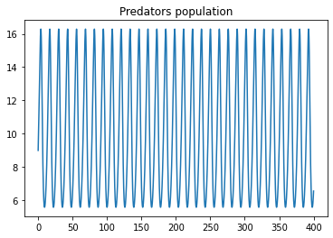

---
## Front matter
title: Лабораторная работа №5. Модель хищник-жертва
author: [Доборщук Владимир Владимирович]
institute: "RUDN University, Moscow, Russian Federation"
subtitle: "c/б 1032186063 | НФИбд-01-18"
date: 13 марта 2021
lang: "ru"
## Formatting
toc: false
slide_level: 2
theme: metropolis
mainfont: PT Serif
romanfont: PT Serif
sansfont: PT Sans
monofont: Fira Sans
header-includes:
 - \metroset{progressbar=frametitle,sectionpage=progressbar,numbering=fraction}
 - '\makeatletter'
 - '\beamer@ignorenonframefalse'
 - '\makeatother'
aspectratio: 43
section-titles: true

---
# Цели и задачи

## Цель

Изучить модель "хищник - жертва" (модель Лотки-Вольтерры) и реализовать процесс моделирования с помощью программных средств.

## Задачи

* изучить теорию о модели "хищник - жертва"
* построить модель "хищник - жертва":
  * построить графики изменения численности хищников, жертв
  * построить график зависимости численности жертв и хищников
  * найти стационарное состояние данной модели

# Ход выполнения лабораторной работы

## Теоретическая справка

Простейшая модель взаимодействия двух видов типа «хищник — жертва» - модель Лотки-Вольтерры. Данная двувидовая модель основывается на следующих предположениях:

1. Численность популяции жертв $x$ и хищников $y$ зависят только от времени (модель не учитывает пространственное распределение популяции на занимаемой территории)

2. В отсутствии взаимодействия численность видов изменяется по модели Мальтуса, при этом число жертв увеличивается, а число хищников падает

## Теоретическая справка

3. Естественная смертность жертвы и естественная рождаемость хищника считаются несущественными

4. Эффект насыщения численности обеих популяций не учитывается

5. Скорость роста численности жертв уменьшается пропорционально численности хищников

## Теоретическая справка

$$
\begin{cases}
    \frac{dx}{dt} = ax(t)-bx(t)y(t)\\
    \frac{dy}{dt} = -cy(t)+dx(t)y(t)
\end{cases}
$$

В этой модели $x$ – число жертв, $y$ - число хищников. Коэффициент $a$ описывает скорость естественного прироста числа жертв в отсутствие хищников, с - естественное вымирание хищников, лишенных пищи в виде жертв. Вероятность взаимодействия жертвы и хищника считается пропорциональной как количеству жертв, так и числу самих хищников ($xy$). Каждый акт взаимодействия уменьшает популяцию жертв, но способствует увеличению популяции хищников (члены $-bxy$ и $dxy$ в правой части уравнения). 

## Начальные данные

**Вариант 14**: $(1032186063\mod{70}) + 1$

$a = 0.77$

$b = 0.077$

$c = 0.33$

$d = 0.033$

$x_0 = 4, y_0 = 9$


## Программная реализация

**Инициализация библиотек**

```python
import numpy as np
import matplotlib.pyplot as plt
from scipy.integrate import odeint
```

## Программная реализация

Введём соответствующие нашему варианту начальные данные для построения модели:

```python
a = 0.77
b = 0.077
c = 0.33
d = 0.033

v0 = [4, 9] # x0, y0
t = np.arange(0, 400, 0.1)
```


## Программная реализация

Создадим функцию для нашей СДУ:


```python
def syst(x, t):
    dx1 = -a*x[0] + b*x[0]*x[1]
    dx2 = c*x[1] - d*x[0]*x[1]
    return [dx1, dx2]
```


## Программная реализация

Воспользуемся функцией `odeint` из модуля `scipy.integrate` и решим нашу СДУ, после чего выделим значения популяции жертв (`y1`) и хищников (`y2`)


```python
y = odeint(syst, v0, t)
y1 = y[:, 0] # значения популяции жертв
y2 = y[:, 1] # значения популяции хищников
```

## Графики численности хищников, жертв

С помощью модуля `matplotlib.pyplot` построим графики изменения численности хищников и жертв.

## Графики численности хищников, жертв

```python
plt.title('Victims population')
plt.plot(t, y1)
```

    
{ #fig:001 width=60% }

## Графики численности хищников, жертв


```python
plt.title('Predators population')
plt.plot(t, y2)
```

    
{ #fig:002 width=60% }

## Графики численности хищников, жертв

```python
plt.title('Victims and Predators population')
plt.plot(t, y1, label='victims')
plt.plot(t, y2, label='predators')
plt.legend(loc='upper right')
```

    
{ #fig:003 width=60% }

## График зависимости численности хищников от численности жертв

На следующем этапе нам необходимо вычислить точку стационарного состояния системы $\left(x_0 = \frac{c}{d}, y_0 = \frac{a}{b}\right)$. После её нахождения - построим график зависимости численности хищников от численности жертв.

## График зависимости численности хищников от численности жертв

```python
x0 = c/d
y0 = a/b

plt.title('Dependece of predators from victims')
plt.plot(y1, y2, 'steelblue')
plt.plot(x0, y0, color='firebrick', marker='o', label='Стационарное значение')
plt.legend()

print('Точка стационарного значения: ('+ str(x0)+', '+ str(y0)+ ')')
```

## График зависимости численности хищников от численности жертв

Точка стационарного значения: (10.0, 10.0)
    
{ #fig:004 width=60% }


# Выводы

Была успешно изучена теорию о модели "хищник - жертва", после чего были грамотно реализованы графики изменения популяции хищников и жертв, график зависимости количества хищников от жертв и была найдена точка стационарного состояния системы. Реализация делалась на языке Python.