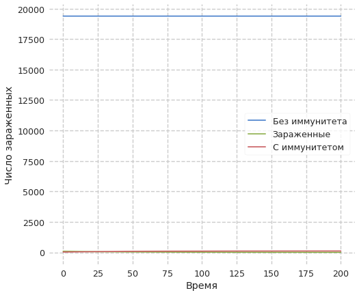
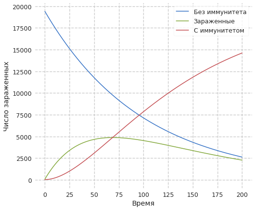

---
## Front matter
title: Лабораторная работа №6. Модель эпидемии
author: [Доборщук Владимир Владимирович]
institute: "RUDN University, Moscow, Russian Federation"
subtitle: "c/б 1032186063 | НФИбд-01-18"
date: 20 марта 2021
lang: "ru"
## Formatting
toc: false
slide_level: 2
theme: metropolis
mainfont: PT Serif
romanfont: PT Serif
sansfont: PT Sans
monofont: Fira Sans
header-includes:
 - \metroset{progressbar=frametitle,sectionpage=progressbar,numbering=fraction}
 - '\makeatletter'
 - '\beamer@ignorenonframefalse'
 - '\makeatother'
aspectratio: 43
section-titles: true

---
# Цели и задачи

## Цель

Изучить простейшую модель эпидемии, а также реализовать её программно..

## Задачи

* изучить теорию о модели эпидемии
* построить модель для случаев:
  * $I(t) \ge I^{*}$
  * $I(t) \le I^{*}$

# Ход выполнения лабораторной работы

## Теоретическая справка

Рассмотрим простейшую модель эпидемии. Предположим, что некая популяция, состоящая из $N$ особей, (считаем, что популяция изолирована) подразделяется на три группы. Первая группа - это восприимчивые к болезни, но пока здоровые особи, обозначим их через $S(t)$. Вторая группа – это число инфицированных особей, которые также при этом являются распространителями инфекции, обозначим их $I(t)$. А третья группа, обозначающаяся через $R(t)$ – это здоровые особи с иммунитетом к болезни.

## Теоретическая справка

До того, как число заболевших не превышает критического значения $I^*$, считаем, что все больные изолированы и не заражают здоровых. Когда $I(t) \ge I$, тогда инфицирование способны заражать восприимчивых к болезни особей. Для этого случая:

$\frac{dS}{dt} = -\alpha{S}$

$\frac{dI}{dt} = \alpha{S}-\beta{I}$

$\frac{dR}{dt} = \beta{I}$

## Теоретическая справка

Для случая, когда $I(t) \le I$:

$\frac{dS}{dt} = 0$

$\frac{dI}{dt} = -\beta{I}$

$\frac{dR}{dt} = \beta{I}$

## Начальные данные

**Вариант 14**: $(1032186063\mod{70}) + 1$

$N = 19500$

$I_0 = 88$

$R_0 = 25$

$\alpha = 0.01, \beta = 0.02$

## Программная реализация

**Инициализация библиотек**

```python
import numpy as np
import matplotlib.pyplot as plt
from scipy.integrate import odeint

from jupyterthemes import jtplot
jtplot.style(context='notebook', fscale=1.2, spines=False, gridlines='--')
```

## Программная реализация

Введём соответствующие нашему варианту начальные данные для построения модели:

```python
N = 19500
t0 = 0
I0 = 88
R0 = 25
S0 = N - R0 - I0

alpha = 0.01
beta = 0.02

x0 = np.array([S0, I0, R0])
t = np.arange(0, 200, 0.01)
```

## Программная реализация

Создадим функцию для наших СДУ:


```python
def dx_less(x,t):
    dS_dt = 0.0
    dI_dt = -beta*x[1]
    dR_dt = beta*x[1]
    return [dS_dt, dI_dt, dR_dt]
    
def dx_greater(x,t):
    dS_dt = -alpha*x[0]
    dI_dt = alpha*x[0] - beta*x[1]
    dR_dt = beta*x[1]
    return [dS_dt, dI_dt, dR_dt]
```


## Программная реализация

Воспользуемся функцией `odeint` из модуля `scipy.integrate` и решим наши СДУ, после чего выделим значения для первого и второго случая в две разные переменные


```python
y_less = odeint(dx_less, x0, t)
y_greater = odeint(dx_greater, x0, t)
```

## Модель при $I(t) \le I^{*}$


```python
S = [e for e in y_less[:,0]]
I = [e for e in y_less[:,1]]
R = [e for e in y_less[:,2]]

plt.plot(t, S, label='Без иммунитета')
plt.plot(t, I, label='Зараженные')
plt.plot(t, R, label='С иммунитетом')
plt.ylabel('Число зараженных')
plt.xlabel('Время')
plt.legend(loc='best')
plt.show()
```

## Модель при $I(t) \le I^{*}$

{ #fig:001 width=60% }

## Модель при $I(t) \ge I^{*}$


```python
S = [e for e in y_greater[:,0]]
I = [e for e in y_greater[:,1]]
R = [e for e in y_greater[:,2]]

plt.plot(t, S, label='Без иммунитета')
plt.plot(t, I, label='Зараженные')
plt.plot(t, R, label='С иммунитетом')
plt.legend(loc='best')
plt.ylabel('Число зараженных')
plt.xlabel('Время')
plt.show()
```

## Модель при $I(t) \ge I^{*}$

{ #fig:002 width=60% }


# Выводы

Мы изучили простейшую модель эпидемии, после чего успешно реализовали её с помощью языка Python и дополняющих его модулей.