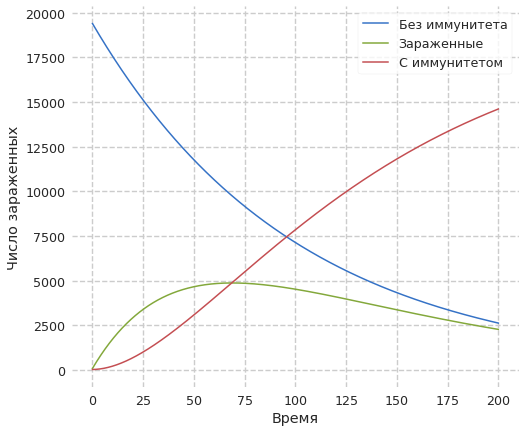

---
title: "Лабораторная работа №6. Модель эпидемии"
author: [Доборщук Владимир Владимирович]
institute: "RUDN University, Moscow, Russian Federation"
date: "20 марта 2021"
subtitle: "c/б 1032186063 | НФИбд-01-18"
keywords: [Моделирование, Лабораторная]
lang: "ru"
toc-title: "Содержание"
toc: true # Table of contents
toc_depth: 2
lof: true # List of figures
fontsize: 12pt
mainfont: PT Serif
romanfont: PT Serif
sansfont: PT Sans
monofont: Fira Sans
mainfontoptions: Ligatures=TeX
romanfontoptions: Ligatures=TeX
sansfontoptions: Ligatures=TeX,Scale=MatchLowercase
monofontoptions: Scale=MatchLowercase
titlepage: true
titlepage-text-color: "000000"
titlepage-rule-color: "1A1B35"
titlepage-rule-height: 2
listings-no-page-break: true
indent: true
header-includes:
  - \usepackage{sectsty}
  - \sectionfont{\clearpage}
  - \linepenalty=10 # the penalty added to the badness of each line within a paragraph (no associated penalty node) Increasing the value makes tex try to have fewer lines in the paragraph.
  - \interlinepenalty=0 # value of the penalty (node) added after each line of a paragraph.
  - \hyphenpenalty=50 # the penalty for line breaking at an automatically inserted hyphen
  - \exhyphenpenalty=50 # the penalty for line breaking at an explicit hyphen
  - \binoppenalty=700 # the penalty for breaking a line at a binary operator
  - \relpenalty=500 # the penalty for breaking a line at a relation
  - \clubpenalty=150 # extra penalty for breaking after first line of a paragraph
  - \widowpenalty=150 # extra penalty for breaking before last line of a paragraph
  - \displaywidowpenalty=50 # extra penalty for breaking before last line before a display math
  - \brokenpenalty=100 # extra penalty for page breaking after a hyphenated line
  - \predisplaypenalty=10000 # penalty for breaking before a display
  - \postdisplaypenalty=0 # penalty for breaking after a display
  - \floatingpenalty = 20000 # penalty for splitting an insertion (can only be split footnote in standard LaTeX)
  - \raggedbottom # or \flushbottom
  - \usepackage{float} # keep figures where there are in the text
  - \floatplacement{figure}{H} # keep figures where there are in the text
...

# Цели и задачи

**Цель:** изучить простейшую модель эпидемии, а также реализовать её программно.

**Задачи:**

* изучить теорию о модели эпидемии
* построить модель для случаев:
  * $I(t) \ge I^{*}$
  * $I(t) \le I^{*}$

# Теоретическая справка

Рассмотрим простейшую модель эпидемии. Предположим, что некая популяция, состоящая из $N$ особей, (считаем, что популяция изолирована) подразделяется на три группы. Первая группа - это восприимчивые к болезни, но пока здоровые особи, обозначим их через $S(t)$. Вторая группа – это число инфицированных особей, которые также при этом являются распространителями инфекции, обозначим их $I(t)$. А третья группа, обозначающаяся через $R(t)$ – это здоровые особи с иммунитетом к болезни.

До того, как число заболевших не превышает критического значения $I^*$, считаем, что все больные изолированы и не заражают здоровых. Когда $I(t) \ge I$, тогда инфицирование способны заражать восприимчивых к болезни особей. Для этого случая:

$\frac{dS}{dt} = -\alpha{S}\\$

$\frac{dI}{dt} = \alpha{S}-\beta{I}\\$

$\frac{dR}{dt} = \beta{I}$

Для случая, когда $I(t) \le I$:

$\frac{dS}{dt} = 0\\$

$\frac{dI}{dt} = -\beta{I}\\$

$\frac{dR}{dt} = \beta{I}$

# Программная реализация

## Подготовка к моделированию

Все данные соответствуют варианту 14 = $(1032186063\mod{70}) + 1$.

**Инициализация библиотек**


```python
import numpy as np
import matplotlib.pyplot as plt
from scipy.integrate import odeint

from jupyterthemes import jtplot
jtplot.style(context='notebook', fscale=1.2, spines=False, gridlines='--')
```

**Начальные данные и необходимые функции**


```python
N = 19500
t0 = 0
I0 = 88
R0 = 25
S0 = N - R0 - I0

alpha = 0.01
beta = 0.02

x0 = np.array([S0, I0, R0])
t = np.arange(0, 200, 0.01)
```

Объявим необходимые функции, исходя из данной нам информации в теоретической справке.


```python
def dx_less(x,t):
    dS_dt = 0.0
    dI_dt = -beta*x[1]
    dR_dt = beta*x[1]
    return [dS_dt, dI_dt, dR_dt]
    
def dx_greater(x,t):
    dS_dt = -alpha*x[0]
    dI_dt = alpha*x[0] - beta*x[1]
    dR_dt = beta*x[1]
    return [dS_dt, dI_dt, dR_dt]
```

Заложим в переменные решения для наших СДУ с помощью функции `odeint` модуля `scipy.integrate`.


```python
y_less = odeint(dx_less, x0, t)
y_greater = odeint(dx_greater, x0, t)
```

## Построение графиков для модели

### Модель при $I(t) \le I^{*}$


```python
S = [e for e in y_less[:,0]]
I = [e for e in y_less[:,1]]
R = [e for e in y_less[:,2]]

plt.plot(t, S, label='Без иммунитета')
plt.plot(t, I, label='Зараженные')
plt.plot(t, R, label='С иммунитетом')
plt.ylabel('Число зараженных')
plt.xlabel('Время')
plt.legend(loc='best')
plt.show()
```


    

    


### Модель при $I(t) \ge I^{*}$


```python
S = [e for e in y_greater[:,0]]
I = [e for e in y_greater[:,1]]
R = [e for e in y_greater[:,2]]

plt.plot(t, S, label='Без иммунитета')
plt.plot(t, I, label='Зараженные')
plt.plot(t, R, label='С иммунитетом')
plt.legend(loc='best')
plt.ylabel('Число зараженных')
plt.xlabel('Время')
plt.show()
```


    

    


# Выводы

Мы изучили простейшую модель эпидемии, после чего успешно реализовали её с помощью языка Python и дополняющих его модулей.