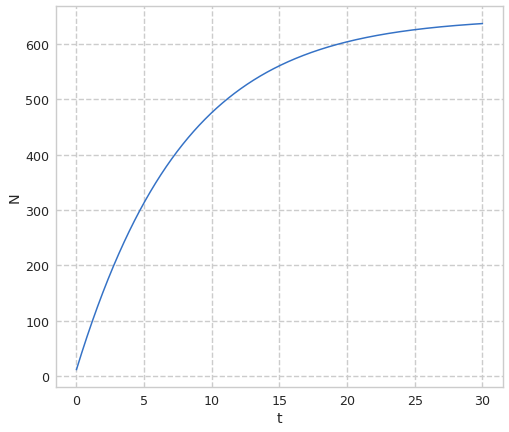
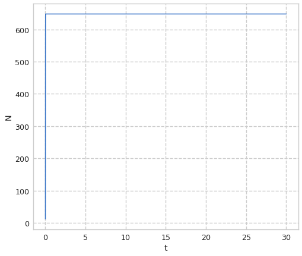

---
## Front matter
title: Лабораторная работа №7. Модель эффективности релкамы
author: [Доборщук Владимир Владимирович]
institute: "RUDN University, Moscow, Russian Federation"
subtitle: "c/б 1032186063 | НФИбд-01-18"
date: 27 марта 2021
lang: "ru"
## Formatting
toc: false
slide_level: 2
theme: metropolis
mainfont: PT Serif
romanfont: PT Serif
sansfont: PT Sans
monofont: Fira Sans
header-includes:
 - \metroset{progressbar=frametitle,sectionpage=progressbar,numbering=fraction}
 - '\makeatletter'
 - '\beamer@ignorenonframefalse'
 - '\makeatother'
aspectratio: 43
section-titles: true

---
# Цели и задачи

## Цель

Изучить модель эффективности рекламы, а также реализовать её программно.

## Задачи

* изучить теорию о модели эффективности рекламы
* построить модель для 3 различных случаев $\alpha_1(t)$ и $\alpha_2(t)$

# Ход выполнения лабораторной работы

## Теоретическая справка

Считаем, что $\frac{dn}{dt}$ - скорость изменения со временем числа потребителей, узнавших о товаре и готовых его купить, $t$ - время, прошедшее с начала рекламной кампании, $n(t)$ - число уже информированных клиентов. Эта величина пропорциональна числу покупателей, еще не знающих о нем, это описывается следующим образом: $\alpha_1(t)(N - n(t))$, где $N$ - общее число потенциальных платежеспособных покупателей, $\alpha_1(t) \ge 0$ - характеризует интенсивность рекламной кампании (зависит от затрат на рекламу в данный момент времени).

## Теоретическая справка

Помимо этого, узнавшие о товаре потребители также распространяют полученную информацию среди потенциальных покупателей, не знающих о нем (в этом случае работает т.н. сарафанное радио). Этот вклад в рекламу описывается величиной $\alpha_2(t)n(t)(N-n(t))$, эта величина увеличивается с увеличением потребителей узнавших о товаре. Математическая модель распространения рекламы описывается уравнением:

$$
\frac{dn}{dt} = (\alpha_1(t)+\alpha_2(t)n(t))(N-n(t))
$$

## Теоретическая справка

При $\alpha_1(t) \gg \alpha_2(t)$ получается модель типа модели Мальтуса, В обратном случае, при $\alpha_1(t) \ll \alpha_2(t)$ получаем уравнение логистической кривой.

## Программная реализация

**Инициализация библиотек**

```python
import numpy as np
import matplotlib.pyplot as plt
from scipy.integrate import odeint
from math import sin
from scipy.misc import derivative

from jupyterthemes import jtplot
jtplot.style(context='notebook', fscale=1.2, gridlines='--')
```
## Программная реализация

Введём соответствующие нашему варианту начальные данные для построения модели:

```python
N = 648
t0 = 0
N0 = 12

def k(t):
    return 0.125

def p(t):
    return 0.00002

t = np.arange(0, 30, 0.01)
```

## Программная реализация

Создадим функцию для нашей СДУ:


```python
def XD(x,t):
    xd = (k(t) + p(t)*x)*(N-x)
    return xd
```


## Программная реализация

Воспользуемся функцией `odeint` из модуля `scipy.integrate` и решим нашу СДУ.


```python
x = odeint(XD, N0, t)
```

## Модель 1


```python
plt.plot(t, x)
plt.ylabel('N')
plt.xlabel('t')
plt.show()
```


## Модель 1

    
{ #fig:001 width=60% }

## Модель 2


```python
def k(t):
    return 0.000095

def p(t):
    return 0.92

x = odeint(XD, N0, t)

plt.plot(t, x)
plt.ylabel('N')
plt.xlabel('t')
plt.show()
```

## Модель 2

{ #fig:002 width=60% }

## Модель 2

Найдем момент времени, при котором скорость изменения числа потребителей.

```python
diff = 0
ind = -1
for i in range(1, len(x[:,0])):
    if (x[i][0] - x[i-1][0]) > diff:
        diff = x[i][0] - x[i-1][0]
        ind = i
```

Максимальная скорость изменения числа потребителй будет при t=0.01

## Модель 3


```python
def k(t):
    return sin(10*t)

def p(t):
    return 0.9*t
    
x = odeint(XD, N0, t)

plt.plot(t, x)
plt.ylabel('N')
plt.xlabel('t')
plt.show()
```

## Модель 3

{ #fig:003 width=60% }


# Выводы

Мы изучили простейшую модель эффективности рекламы, после чего успешно реализовали её с помощью языка Python и дополняющих его модулей.