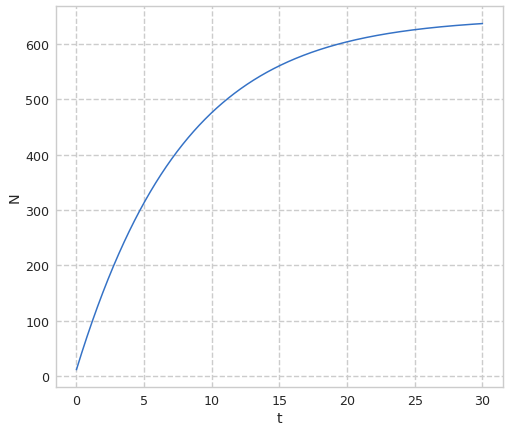
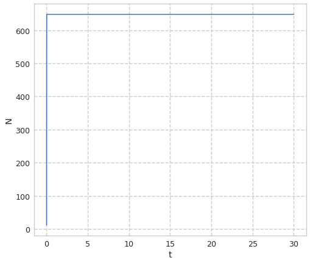
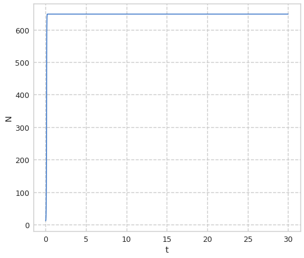

---
title: "Лабораторная работа №7. Модель эффективности рекламы"
author: [Доборщук Владимир Владимирович]
institute: "RUDN University, Moscow, Russian Federation"
date: "27 марта 2021"
subtitle: "c/б 1032186063 | НФИбд-01-18"
keywords: [Моделирование, Лабораторная]
lang: "ru"
toc-title: "Содержание"
toc: true # Table of contents
toc_depth: 2
lof: true # List of figures
fontsize: 12pt
mainfont: PT Serif
romanfont: PT Serif
sansfont: PT Sans
monofont: Fira Sans
mainfontoptions: Ligatures=TeX
romanfontoptions: Ligatures=TeX
sansfontoptions: Ligatures=TeX,Scale=MatchLowercase
monofontoptions: Scale=MatchLowercase
titlepage: true
titlepage-text-color: "000000"
titlepage-rule-color: "1A1B35"
titlepage-rule-height: 2
listings-no-page-break: true
indent: true
header-includes:
  - \usepackage{sectsty}
  - \sectionfont{\clearpage}
  - \linepenalty=10 # the penalty added to the badness of each line within a paragraph (no associated penalty node) Increasing the value makes tex try to have fewer lines in the paragraph.
  - \interlinepenalty=0 # value of the penalty (node) added after each line of a paragraph.
  - \hyphenpenalty=50 # the penalty for line breaking at an automatically inserted hyphen
  - \exhyphenpenalty=50 # the penalty for line breaking at an explicit hyphen
  - \binoppenalty=700 # the penalty for breaking a line at a binary operator
  - \relpenalty=500 # the penalty for breaking a line at a relation
  - \clubpenalty=150 # extra penalty for breaking after first line of a paragraph
  - \widowpenalty=150 # extra penalty for breaking before last line of a paragraph
  - \displaywidowpenalty=50 # extra penalty for breaking before last line before a display math
  - \brokenpenalty=100 # extra penalty for page breaking after a hyphenated line
  - \predisplaypenalty=10000 # penalty for breaking before a display
  - \postdisplaypenalty=0 # penalty for breaking after a display
  - \floatingpenalty = 20000 # penalty for splitting an insertion (can only be split footnote in standard LaTeX)
  - \raggedbottom # or \flushbottom
  - \usepackage{float} # keep figures where there are in the text
  - \floatplacement{figure}{H} # keep figures where there are in the text
...

# Цели и задачи

**Цель:** изучить модель эффективности рекламы, а также реализовать её программно.

**Задачи:**

* изучить теорию о модели эффективности рекламы
* построить модель для 3 различных случаев $\alpha_1(t)$ и $\alpha_2(t)$

# Теоретическая справка

Модель рекламной кампании описывается следующими величинами: 

Считаем, что $\frac{dn}{dt}$ - скорость изменения со временем числа потребителей, узнавших о товаре и готовых его купить, $t$ - время, прошедшее с начала рекламной кампании, $n(t)$ - число уже информированных клиентов. Эта величина пропорциональна числу покупателей, еще не знающих о нем, это описывается следующим образом: $\alpha_1(t)(N - n(t))$, где $N$ - общее число потенциальных платежеспособных покупателей, $\alpha_1(t) \ge 0$ - характеризует интенсивность рекламной кампании (зависит от затрат на рекламу в данный момент времени). Помимо этого, узнавшие о товаре потребители также распространяют полученную информацию среди потенциальных покупателей, не знающих о нем (в этом случае работает т.н. сарафанное радио). Этот вклад в рекламу описывается величиной $\alpha_2(t)n(t)(N-n(t))$, эта величина увеличивается с увеличением потребителей узнавших о товаре. Математическая модель распространения рекламы описывается уравнением:

$$
\frac{dn}{dt} = (\alpha_1(t)+\alpha_2(t)n(t))(N-n(t))
$$

При $\alpha_1(t) \gg \alpha_2(t)$ получается модель типа модели Мальтуса, В обратном случае, при $\alpha_1(t) \ll \alpha_2(t)$ получаем уравнение логистической кривой.

# Программная реализация

## Подготовка к моделированию

Все данные соответствуют варианту 14 = $(1032186063\mod{70}) + 1$.

**Инициализация библиотек**


```python
import numpy as np
import matplotlib.pyplot as plt
from scipy.integrate import odeint
from math import sin
from scipy.misc import derivative

from jupyterthemes import jtplot
jtplot.style(context='notebook', fscale=1.2, gridlines='--')
```

**Начальные данные и необходимые функции**


```python
N = 648
t0 = 0
N0 = 12

def k(t):
    return 0.125

def p(t):
    return 0.00002

t = np.arange(0, 30, 0.01)
```

Объявим необходимые функции, исходя из данной нам информации в теоретической справке.


```python
def XD(x,t):
    xd = (k(t) + p(t)*x)*(N-x)
    return xd
```

Заложим в переменную решения для наших СДУ с помощью функции `odeint` модуля `scipy.integrate`.


```python
x = odeint(XD, N0, t)
```

## Построение графиков для модели

### Модель 1


```python
plt.plot(t, x)
plt.ylabel('N')
plt.xlabel('t')
plt.show()
```


    

    


### Модель 2


```python
def k(t):
    return 0.000095

def p(t):
    return 0.92

x = odeint(XD, N0, t)

plt.plot(t, x)
plt.ylabel('N')
plt.xlabel('t')
plt.show()
```


    

    

Найдем момент времени, при котором скорость изменения числа потребителей.

```python
diff = 0
ind = -1
for i in range(1, len(x[:,0])):
    if (x[i][0] - x[i-1][0]) > diff:
        diff = x[i][0] - x[i-1][0]
        ind = i
```

Максимальная скорость изменения числа потребителй будет при t=0.01


## Модель 3


```python
def k(t):
    return sin(10*t)

def p(t):
    return 0.9*t
    
x = odeint(XD, N0, t)

plt.plot(t, x)
plt.ylabel('N')
plt.xlabel('t')
plt.show()
```


    

    


# Выводы

Мы изучили простейшую модель эффективности рекламы, после чего успешно реализовали её с помощью языка Python и дополняющих его модулей.
