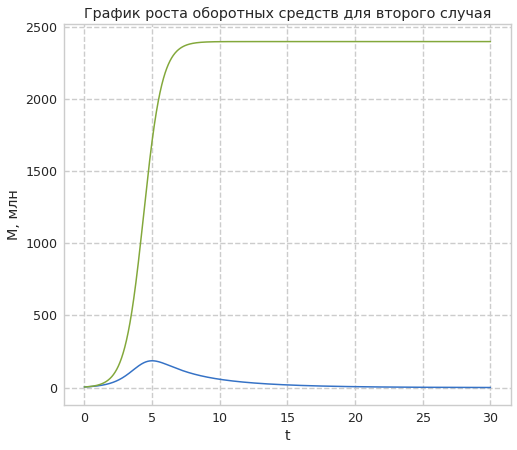

---
## Front matter
title: Лабораторная работа №8. Модель конкуренции двух фирм
author: [Доборщук Владимир Владимирович]
institute: "RUDN University, Moscow, Russian Federation"
subtitle: "c/б 1032186063 | НФИбд-01-18"
date: 3 апреля 2021
lang: "ru"
## Formatting
toc: false
slide_level: 2
theme: metropolis
mainfont: PT Serif
romanfont: PT Serif
sansfont: PT Sans
monofont: Fira Sans
header-includes:
 - \metroset{progressbar=frametitle,sectionpage=progressbar,numbering=fraction}
 - '\makeatletter'
 - '\beamer@ignorenonframefalse'
 - '\makeatother'
aspectratio: 43
section-titles: true

---
# Цели и задачи

## Цель

Изучить модель конкуренции двух фирм, а также реализовать её программно.

## Задачи

* изучить теорию о модели конкуренции двух фирм
* программно реализовать графики модели для двух различных случаев

# Ход выполнения лабораторной работы

## Теоретическая справка

**Случай 1:**

Рассмотрим две фирмы, производящие взаимозаменяемые товары одинакового качества и находящиеся в одной рыночной нише. Считаем, что в рамках нашей модели конкурентная борьба ведётся только рыночными методами. То есть, конкуренты могут влиять на противника путем изменения параметров своего производства: себестоимость, время цикла, но не могут прямо вмешиваться в ситуацию на рынке («назначать» цену или влиять на потребителей каким-либо иным способом.) Будем считать, что постоянные издержки пренебрежимо малы, и в модели учитывать не будем. В этом случае динамика изменения объемов продаж фирмы 1 и фирмы 2 описывается следующей системой уравнений:

## Теоретическая справка


$$\frac{dM_1}{d\theta}=M_1-\frac{b}{c_1}M_1M_2-\frac{a_1}{c_1}M_1^2$$    
$$\frac{dM_2}{d\theta}=\frac{c_2}{c_1}M_2-\frac{b}{c_1}M_1M_2-\frac{a_2}{c_1}M_2^2$$


## Теоретическая справка

**Случай 2:**

Рассмотрим модель, когда, помимо экономического фактора влияния (изменение себестоимости, производственного цикла, использование кредита и т.п.), используются еще и социально-психологические факторы – формирование общественного предпочтения одного товара другому, не зависимо от их качества и цены. В этом случае взаимодействие двух фирм будет зависеть друг от друга, соответственно коэффициент перед $M_1M_2$ будет отличаться. Пусть в рамках рассматриваемой модели динамика изменения объемов продаж фирмы 1 и фирмы 2 описывается следующей системой уравнений:

## Теоретическая справка


$$\frac{dM_1}{d\theta}=M_1-(\frac{b}{c_1}+0.0005)M_1M_2-\frac{a_1}{c_1}M_1^2$$    
$$\frac{dM_2}{d\theta}=\frac{c_2}{c_1}M_2-\frac{b}{c_1}M_1M_2-\frac{a_2}{c_1}M_2^2$$

## Теоретическая справка

Для обоих случаев:  
$N$ – число потребителей производимого продукта  
$\tau$ – длительность производственного цикла  
$p$ – рыночная цена товара  
$\tilde{p}$ – себестоимость продукта, то есть переменные издержки на производство единицы продукции  
$q$ – максимальная потребность одного человека в продукте в единицу времени  
$\theta=\frac{t}{c_1}$ - безразмерное время   
$M_0^1=4.7, M_0^2=4.2,
p_{cr}=11.1, N=32, q=1,
\tau_1=17, \tau_2=27, \tilde{p_1}=7.7, \tilde{p_2}=5.5$  
$a_1=\frac{p_{cr}}{\tau_1^2\tilde{p_1^2}Nq}, a_2=\frac{p_{cr}}{\tau_2^2\tilde{p_2^2}Nq}, b=\frac{p_{cr}}{\tau_1^2\tilde{p_1^2}\tau_2^2\tilde{p_2^2}Nq}, c_1=\frac{p_{cr}-\tilde{p_1}}{\tau_1\tilde{p_1}}, c_2=\frac{p_{cr}-\tilde{p_2}}{\tau_2\tilde{p_2}}$  
$t=c_1\theta$

## Программная реализация

**Инициализация библиотек**

```python
import numpy as np
import matplotlib.pyplot as plt
from scipy.integrate import odeint
from math import sin
from scipy.misc import derivative

from jupyterthemes import jtplot
jtplot.style(context='notebook', fscale=1.2, gridlines='--')
```
## Программная реализация

Введём соответствующие нашему варианту (14) начальные данные для построения модели:

```python
p_cr = 11.1
tau1 = 17
p1 = 7.7
tau2 = 27
p2 = 5.5
N = 32
q = 1

a1 = p_cr / (tau1**2 * p1**2 * N * q)
a2 = p_cr / (tau2**2 * p2**2 * N * q)
b = p_cr / (tau1**2 * tau2**2 * p1**2 * p2**2 * N * q)
c1 = (p_cr - p1)/(tau1 * p1)
c2 = (p_cr - p2)/(tau2 * p2)

t0 = 0
x0 = [4.7, 4.2]
t = np.arange(t0, 30, 0.01)
```


## Программная реализация

Создадим функции для нашей СДУ:


```python
def dx_f(x,t):
    dx1 = x[0] - (a1/c1)*x[0]**2 - (b/c1)*x[0]*x[1]
    dx2 = (c2/c1)*x[1] - (a2/c1)*x[1]**2 - (b/c1)*x[0]*x[1]
    return [dx1, dx2]

def dx_s(x,t):
    dx1 = x[0] - (a1/c1)*x[0]**2 - (b/c1 + 0.0005)*x[0]*x[1]
    dx2 = (c2/c1)*x[1] - (a2/c1)*x[1]**2 - (b/c1)*x[0]*x[1]
    return [dx1, dx2]
```

## Программная реализация

Воспользуемся функцией `odeint` из модуля `scipy.integrate` и решим нашу СДУ.


```python
y1 = odeint(dx_f, x0, t)
y2 = odeint(dx_s, x0, t)
```

## Модель 1

```python
plt.plot(t, y1)
plt.ylabel('M, млн')
plt.xlabel('t')
plt.title('График роста оборотных средств для первого случая')
plt.show()
```

## Модель 1

    
{ #fig:001 width=60% }

## Модель 2


```python
plt.plot(t, y2)
plt.ylabel('M, млн')
plt.xlabel('t')
plt.title('График роста оборотных средств для второго случая')
plt.show()
```

## Модель 2

(image/output_19_0.png){ #fig:002 width=60% }


# Выводы

Мы изучили теорию о модели конкуренции двух фирм, а также реализовали программно два случая этой модели с помощью Python.
