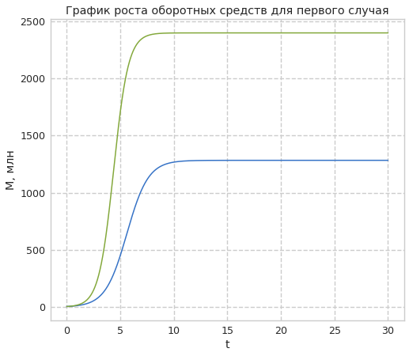

---
title: "Лабораторная работа №8. Модель конкуренции двух фирм"
author: [Доборщук Владимир Владимирович]
institute: "RUDN University, Moscow, Russian Federation"
date: "3 апреля 2021"
subtitle: "c/б 1032186063 | НФИбд-01-18"
keywords: [Моделирование, Лабораторная]
lang: "ru"
toc-title: "Содержание"
toc: true # Table of contents
toc_depth: 2
lof: true # List of figures
fontsize: 12pt
mainfont: PT Serif
romanfont: PT Serif
sansfont: PT Sans
monofont: Fira Sans
mainfontoptions: Ligatures=TeX
romanfontoptions: Ligatures=TeX
sansfontoptions: Ligatures=TeX,Scale=MatchLowercase
monofontoptions: Scale=MatchLowercase
titlepage: true
titlepage-text-color: "000000"
titlepage-rule-color: "1A1B35"
titlepage-rule-height: 2
listings-no-page-break: true
indent: true
header-includes:
  - \usepackage{sectsty}
  - \sectionfont{\clearpage}
  - \linepenalty=10 # the penalty added to the badness of each line within a paragraph (no associated penalty node) Increasing the value makes tex try to have fewer lines in the paragraph.
  - \interlinepenalty=0 # value of the penalty (node) added after each line of a paragraph.
  - \hyphenpenalty=50 # the penalty for line breaking at an automatically inserted hyphen
  - \exhyphenpenalty=50 # the penalty for line breaking at an explicit hyphen
  - \binoppenalty=700 # the penalty for breaking a line at a binary operator
  - \relpenalty=500 # the penalty for breaking a line at a relation
  - \clubpenalty=150 # extra penalty for breaking after first line of a paragraph
  - \widowpenalty=150 # extra penalty for breaking before last line of a paragraph
  - \displaywidowpenalty=50 # extra penalty for breaking before last line before a display math
  - \brokenpenalty=100 # extra penalty for page breaking after a hyphenated line
  - \predisplaypenalty=10000 # penalty for breaking before a display
  - \postdisplaypenalty=0 # penalty for breaking after a display
  - \floatingpenalty = 20000 # penalty for splitting an insertion (can only be split footnote in standard LaTeX)
  - \raggedbottom # or \flushbottom
  - \usepackage{float} # keep figures where there are in the text
  - \floatplacement{figure}{H} # keep figures where there are in the text
...

# Цели и задачи

**Цель:** изучить модель конкуренции двух фирм, а также реализовать её программно.

**Задачи:**

* изучить теорию о модели конкуренции двух фирм
* программно реализовать графики модели для двух различных случаев

# Теоретическая справка

Для построения модели конкуренции хотя бы двух фирм необходимо рассмотреть модель одной фирмы. Вначале рассмотрим модель фирмы, производящей продукт долговременного пользования, когда цена его определяется балансом спроса и предложения. Примем, что этот продукт занимает определенную нишу рынка и конкуренты в ней отсутствуют.


Обозначим:

$N$ – число потребителей производимого продукта.

$S$ – доходы потребителей данного продукта. Считаем, что доходы всех потребителей одинаковы. Это предположение справедливо, если речь идет об одной рыночной нише, т.е. производимый продукт ориентирован на определенный слой населения.

$M$ – оборотные средства предприятия.

$\tau$ – длительность производственного цикла.

$p$ – рыночная цена товара.

$\tilde{p}$ – себестоимость продукта, то есть переменные издержки на производство единицы продукции.

$\delta$ – доля оборотных средств, идущая на покрытие переменных издержек.

$\kappa$ – постоянные издержки, которые не зависят от количества выпускаемой продукции

$Q(S/p)$ – функция спроса, зависящая от отношения дохода $S$ к цене $p$. Она равна количеству продукта, потребляемого одним потребителем в единицу времени.

Функцию спроса товаров долговременного использования часто
представляют в простейшей форме:

$$
Q = q-k\frac{p}{S} = q\left(1-\frac{p}{p_{cr}}\right),
$$

где $q$ – максимальная потребность одного человека в продукте в единицу времени. Эта функция падает с ростом цены и при $p$ = $p_{cr}$ (критическая стоимость продукта) потребители отказываются от приобретения товара. Величина $p_{cr} = Sq/k$. Параметр $k$ – мера эластичности функции спроса по цене. Таким образом, функция спроса в форме вышеуказанного уравнения является пороговой (то есть, $Q(S/p)$ = 0 при $p \ge p_{cr}$) и обладает свойствами насыщения.

Уравнения динамики оборотных средств можно записать в виде

$$
\frac{dM}{dt} = -\frac{M\delta}{\tau} + NQp-\kappa = -\frac{M\delta}{\tau} + Nq\left(1-\frac{p}{p_{cr}}\right)p - \kappa
$$

Уравнение для рыночной цены $p$ представим в виде

$$
\frac{dp}{dt} = \gamma\left(-\frac{M\delta}{\tau\tilde{p}} + Nq\left(1-\frac{p}{p_{cr}}\right)\right) 
$$

Первый член соответствует количеству поставляемого на рынок товара (то есть, предложению), а второй член – спросу.

Параметр $\gamma$ зависит от скорости оборота товаров на рынке. Как правило, время торгового оборота существенно меньше времени производственного цикла $\tau$. При заданном $M$ последнее уравнение описывает быстрое стремление цены к равновесному значению цены, которое устойчиво.

В этом случае его можно заменить алгебраическим соотношением

$$
-\frac{M\delta}{\tau\tilde{p}} + Nq\left(1-\frac{p}{p_{cr}}\right) = 0
$$

Из этого равенства следует, что равновесное значение цены $p$ равно 

$$
p=p_{cr}\left(1-\frac{M\delta}{\tau\tilde{p}Nq}\right)
$$

Второе уравнение с учетом значения $p$ приобретает вид

$$
\frac{dM}{dt} = M\frac{\delta}{\tau}\left(\frac{p_{cr}}{\tilde{p}} - 1\right) - M^2\left(\frac{\delta}{\tau\tilde{p}}\right)^2\frac{p_{cr}}{Nq} - \kappa
$$

Данное уравнение имеет два стационарных решения, соответствующих условию $\frac{dM}{dt} = 0$:

$$
\tilde{M}_{1,2} = \frac{1}{2}a \pm \sqrt{\frac{a^2}{4} - b}
$$

где

$$
a = Nq\left(1-\frac{\tilde{p}}{p_{cr}}\right)\tilde{p}\frac{\tau}{\delta}, b = \kappa Nq\frac{\left(\tau\tilde{p}\right)^2}{p_{cr}\delta^2}.
$$

**Случай 1:**

Рассмотрим две фирмы, производящие взаимозаменяемые товары одинакового качества и находящиеся в одной рыночной нише. Считаем, что в рамках нашей модели конкурентная борьба ведётся только рыночными методами. То есть, конкуренты могут влиять на противника путем изменения параметров своего производства: себестоимость, время цикла, но не могут прямо вмешиваться в ситуацию на рынке («назначать» цену или влиять на потребителей каким-либо иным способом.) Будем считать, что постоянные издержки пренебрежимо малы, и в модели учитывать не будем. В этом случае динамика изменения объемов продаж фирмы 1 и фирмы 2 описывается следующей системой уравнений:

$$\frac{dM_1}{d\theta}=M_1-\frac{b}{c_1}M_1M_2-\frac{a_1}{c_1}M_1^2$$    
$$\frac{dM_2}{d\theta}=\frac{c_2}{c_1}M_2-\frac{b}{c_1}M_1M_2-\frac{a_2}{c_1}M_2^2$$

**Случай 2:**

Рассмотрим модель, когда, помимо экономического фактора влияния (изменение себестоимости, производственного цикла, использование кредита и т.п.), используются еще и социально-психологические факторы – формирование общественного предпочтения одного товара другому, не зависимо от их качества и цены. В этом случае взаимодействие двух фирм будет зависеть друг от друга, соответственно коэффициент перед $M_1M_2$ будет отличаться. Пусть в рамках рассматриваемой модели динамика изменения объемов продаж фирмы 1 и фирмы 2 описывается следующей системой уравнений:

$$\frac{dM_1}{d\theta}=M_1-(\frac{b}{c_1}+0.0005)M_1M_2-\frac{a_1}{c_1}M_1^2$$    
$$\frac{dM_2}{d\theta}=\frac{c_2}{c_1}M_2-\frac{b}{c_1}M_1M_2-\frac{a_2}{c_1}M_2^2$$

Для обоих случаев:  
$N$ – число потребителей производимого продукта  
$\tau$ – длительность производственного цикла  
$p$ – рыночная цена товара  
$\tilde{p}$ – себестоимость продукта, то есть переменные издержки на производство единицы продукции  
$q$ – максимальная потребность одного человека в продукте в единицу времени  
$\theta=\frac{t}{c_1}$ - безразмерное время   
$M_0^1=4.7, M_0^2=4.2,
p_{cr}=11.1, N=32, q=1,
\tau_1=17, \tau_2=27, \tilde{p_1}=7.7, \tilde{p_2}=5.5$  
$a_1=\frac{p_{cr}}{\tau_1^2\tilde{p_1^2}Nq}, a_2=\frac{p_{cr}}{\tau_2^2\tilde{p_2^2}Nq}, b=\frac{p_{cr}}{\tau_1^2\tilde{p_1^2}\tau_2^2\tilde{p_2^2}Nq}, c_1=\frac{p_{cr}-\tilde{p_1}}{\tau_1\tilde{p_1}}, c_2=\frac{p_{cr}-\tilde{p_2}}{\tau_2\tilde{p_2}}$  
$t=c_1\theta$

# Программная реализация

## Подготовка к моделированию

Все данные соответствуют варианту 14 = $(1032186063\mod{70}) + 1$.

**Инициализация библиотек**


```python
import numpy as np
import matplotlib.pyplot as plt
from scipy.integrate import odeint
from math import sin
from scipy.misc import derivative

from jupyterthemes import jtplot
jtplot.style(context='notebook', fscale=1.2, gridlines='--')
```

**Начальные данные и необходимые функции**


```python
p_cr = 11.1
tau1 = 17
p1 = 7.7
tau2 = 27
p2 = 5.5
N = 32
q = 1

a1 = p_cr / (tau1**2 * p1**2 * N * q)
a2 = p_cr / (tau2**2 * p2**2 * N * q)
b = p_cr / (tau1**2 * tau2**2 * p1**2 * p2**2 * N * q)
c1 = (p_cr - p1)/(tau1 * p1)
c2 = (p_cr - p2)/(tau2 * p2)

t0 = 0
x0 = [4.7, 4.2]
t = np.arange(t0, 30, 0.01)
```

Объявим необходимые функции, исходя из данной нам информации в теоретической справке.


```python
def dx_f(x,t):
    dx1 = x[0] - (a1/c1)*x[0]**2 - (b/c1)*x[0]*x[1]
    dx2 = (c2/c1)*x[1] - (a2/c1)*x[1]**2 - (b/c1)*x[0]*x[1]
    return [dx1, dx2]

def dx_s(x,t):
    dx1 = x[0] - (a1/c1)*x[0]**2 - (b/c1 + 0.0005)*x[0]*x[1]
    dx2 = (c2/c1)*x[1] - (a2/c1)*x[1]**2 - (b/c1)*x[0]*x[1]
    return [dx1, dx2]
```

Заложим в переменные решения для наших СДУ с помощью функции `odeint` модуля `scipy.integrate`.


```python
y1 = odeint(dx_f, x0, t)
y2 = odeint(dx_s, x0, t)
```

## Построение графиков для модели

### Модель 1


```python
plt.plot(t, y1)
plt.ylabel('M, млн')
plt.xlabel('t')
plt.title('График роста оборотных средств для первого случая')
plt.show()
```


    

    


### Модель 2


```python
plt.plot(t, y2)
plt.ylabel('M, млн')
plt.xlabel('t')
plt.title('График роста оборотных средств для второго случая')
plt.show()
```


    

    


# Выводы

Мы изучили теорию о модели конкуренции двух фирм, а также реализовали программно два случая этой модели с помощью Python.
