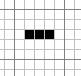
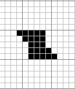
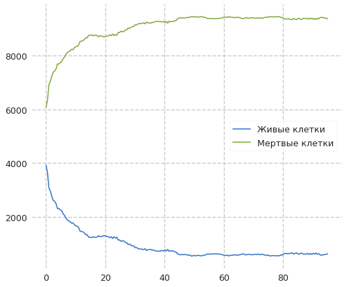
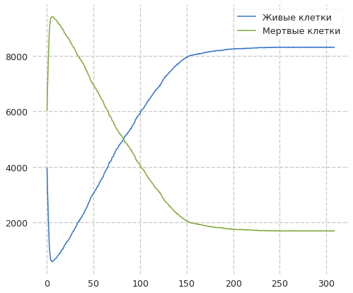

---
## Front matter
title: Анализ сложных систем с помощью моделей клеточных автоматов
author: [Доборщук Владимир Владимирович]
institute: "RUDN University, Moscow, Russian Federation"
subtitle: "c/б 1032186063 | НФИбд-01-18"
date: 24 марта 2021
lang: "ru"
## Formatting
toc: false
slide_level: 2
theme: metropolis
mainfont: PT Serif
romanfont: PT Serif
sansfont: PT Sans
monofont: Fira Sans
header-includes:
 - \metroset{progressbar=frametitle,sectionpage=progressbar,numbering=fraction}
 - '\makeatletter'
 - '\beamer@ignorenonframefalse'
 - '\makeatother'
aspectratio: 43
section-titles: true

---
## Основные определения

**Клеточный автомат** — дискретная модель, изучаемая в математике, теории вычислимости, физике, теоретической биологии и микромеханике. 

Включает регулярную **решётку ячеек**, каждая из которых может находиться в одном из конечного множества состояний, таких как 1 и 0. 

## Основные определения

Клеточный автомат является математическим объектом с дискретными пространством и временем. Каждое положение в пространстве представлено отдельной клеткой, а каждый момент времени - дискретным временным шагом или поколением. 

{ #fig:001 width=60% }

## Игра жизни

Игра разыгрывается на двумерном массиве во избежание краевого эффекта, свернутом в тор. Каждая клетка может быть в одном из двух состояний: клетка может быть "живой" (на экране - черной) или "мертвой" (на экране - белой). Если клетка в текущем моменте времени жива, то в следующем такте времени она будет жива в лишь в том случае, если две или три из восьми соседних клеток живы в текущем такте времени.

## Игра жизни

Часть структур стабилизируются и не изменяются во времени, часть претерпевают циклические изменения, и, наконец, некоторые развиваются, не повторяясь, практически неограниченное время. Эти модусы поведения структур в клеточном автомате соответствуют в дифференциальных уравнениях фиксированной точке, предельному циклу и хаосу. 

## Игра жизни

## Игра жизни

## Клеточные автоматы Стивена Вольфрама

Вольфрам провел эксперименты с самым простым вариантом игры жизнь, в котором среда представляет собой длинную замкнутую ленту шириной в одну клетку. Им двигала идея, что если нельзя понять, что происходит в этом самом простом клеточном автомате, то о более сложных системах и нечего думать.

Правила: клетка может быть живой либо мертвой в зависимости от своего прежнего состояния и состояния двух её соседей. Итого, последующее состояние клетки определяется тремя параметрами. Из возможных состояний 3 ячеек можно составить лишь 8 возможных комбинаций.

## Клеточные автоматы Стивена Вольфрама

По словам Вольфрама, мир представляет собой сложную систему, порожденную этим простым правилом на неком вселенском клеточном автомате от большого взрыва и до мгновения, когда вы читаете эти строки.

Это утверждение упирается в священные споры о том, является ли вселенная вычислимой или вычисление – это лишь ментальная модель, позволяющая нам описывать с некоторой точностью след от «чего-то происходящего как-то».

## Математическое представление клеточного автомата

## Моделирование игры жизни

**Вариант 1**

## Моделирование игры жизни

## Моделирование игры жизни

**Вариант 2**

## Моделирование игры жизни

## Моделирование игры жизни

**Вариант 3**

## Моделирование игры жизни

# Выводы

- Клеточный автомат — дискретная модель, изучаемая в математике, теории вычислимости, физике, теоретической биологии и микромеханике;
- "Игра жизни" разыгрывается на двумерном массиве во избежание краевого эффекта, свернутом в тор. Каждая клетка может быть в одном из двух состояний: клетка может быть "живой" или "мертвой". Если клетка в текущем моменте времени жива, то в следующем такте времени она будет жива в лишь в том случае, если две или три из восьми соседних клеток живы в текущем такте  времени.
- Клеточные автоматы обеспечивают богатую и непрерывно растущую коллекцию типичных моделей, в которых естественные явления могут быть изучены относительно легко.
- Клеточные автоматы очень часто используют при решении задач алгоритмической разрешимости той или иной задачи.

## Список использованных источников

- https://itmodeling.fandom.com/ru/wiki/%D0%90%D0%BD%D0%B0%D0%BB%D0%B8%D0%B7_%D1%81%D0%BB%D0%BE%D0%B6%D0%BD%D1%8B%D1%85_%D1%81%D0%B8%D1%81%D1%82%D0%B5%D0%BC_%D1%81_%D0%BF%D0%BE%D0%BC%D0%BE%D1%89%D1%8C%D1%8E_%D0%BC%D0%BE%D0%B4%D0%B5%D0%BB%D0%B5%D0%B9_%D0%BA%D0%BB%D0%B5%D1%82%D0%BE%D1%87%D0%BD%D1%8B%D1%85_%D0%B0%D0%B2%D1%82%D0%BE%D0%BC%D0%B0%D1%82%D0%BE%D0%B2
- 