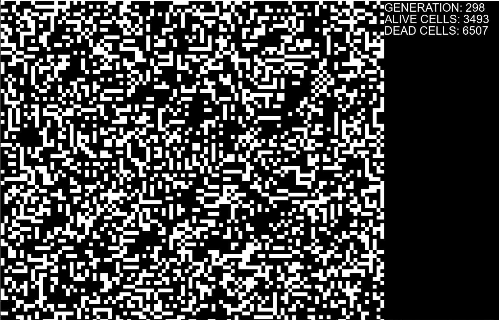
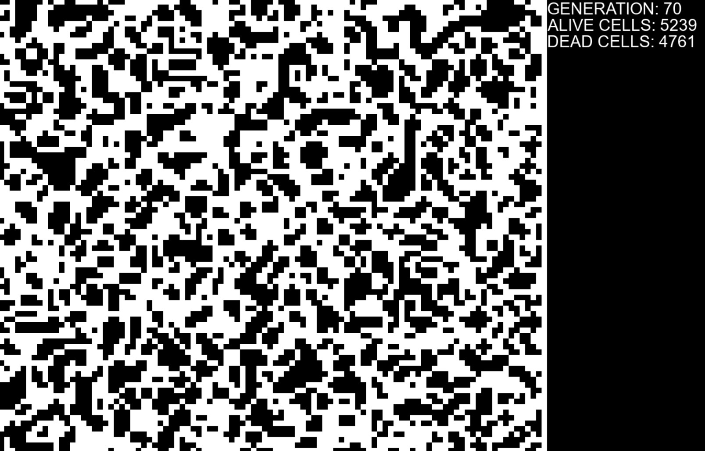
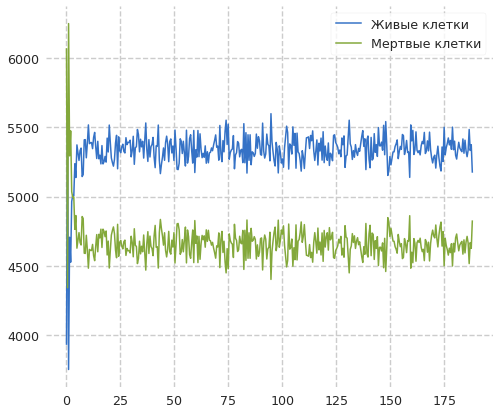

---
## Front matter
title: Анализ сложных систем с помощью моделей клеточных автоматов
author: [Доборщук Владимир Владимирович]
institute: "RUDN University, Moscow, Russian Federation"
subtitle: "c/б 1032186063 | НФИбд-01-18"
date: 24 марта 2021
lang: "ru"
## Formatting
toc: false
slide_level: 2
theme: metropolis
mainfont: PT Serif
romanfont: PT Serif
sansfont: PT Sans
monofont: Fira Sans
header-includes:
 - \metroset{progressbar=frametitle,sectionpage=progressbar,numbering=fraction}
 - '\makeatletter'
 - '\beamer@ignorenonframefalse'
 - '\makeatother'
aspectratio: 43
section-titles: true

---
## Основные определения

**Клеточный автомат** — дискретная модель, изучаемая в математике, теории вычислимости, физике, теоретической биологии и микромеханике. 

Включает регулярную **решётку ячеек**, каждая из которых может находиться в одном из конечного множества состояний, таких как 1 и 0. 

## Основные определения

Клеточный автомат является математическим объектом с дискретными пространством и временем. Каждое положение в пространстве представлено отдельной клеткой, а каждый момент времени - дискретным временным шагом или поколением. 

{ #fig:001 width=40% }

## Игра жизни

Игра разыгрывается на двумерном массиве во избежание краевого эффекта, свернутом в тор. Каждая клетка может быть в одном из двух состояний: клетка может быть "живой" (на экране - черной) или "мертвой" (на экране - белой). Если клетка в текущем моменте времени жива, то в следующем такте времени она будет жива в лишь в том случае, если две или три из восьми соседних клеток живы в текущем такте времени.

## Игра жизни

Часть структур стабилизируются и не изменяются во времени. 

{ #fig:002 width=50% }

## Игра жизни

Часть претерпевают циклические изменения.

{ #fig:003 width=50% }

## Игра жизни

Некоторые развиваются, не повторяясь, практически неограниченное время.

{ #fig:004 width=40% }

## Игра жизни

Эти модусы поведения структур в клеточном автомате соответствуют в дифференциальных уравнениях фиксированной точке, предельному циклу и хаосу.

## Клеточные автоматы Стивена Вольфрама

Вольфрам провел эксперименты с самым простым вариантом игры жизнь, в котором среда представляет собой длинную замкнутую ленту шириной в одну клетку. Им двигала идея, что если нельзя понять, что происходит в этом самом простом клеточном автомате, то о более сложных системах и нечего думать.

Правила: клетка может быть живой либо мертвой в зависимости от своего прежнего состояния и состояния двух её соседей. Итого, последующее состояние клетки определяется тремя параметрами. Из возможных состояний 3 ячеек можно составить лишь 8 возможных комбинаций.

## Клеточные автоматы Стивена Вольфрама

По словам Вольфрама, мир представляет собой сложную систему, порожденную этим простым правилом на неком вселенском клеточном автомате от большого взрыва и до мгновения, когда вы читаете эти строки.

Это утверждение упирается в священные споры о том, является ли вселенная вычислимой или вычисление – это лишь ментальная модель, позволяющая нам описывать с некоторой точностью след от «чего-то происходящего как-то».

## Математическое представление клеточного автомата

Клеточный автомат можно определить как множество конечных автоматов, каждый из которых может находиться в одном из состояний $\sigma \in \sum \equiv \left\{0, 1, 2, \ldots, k-1, k\right\}$.

Изменение состояний автоматов происходит согласно правилу перехода $\sigma_{i,j}(t+1) = \varphi(\sigma_{k,l}(t) | \sigma_{k,l}(t) \in N)$, где $N$ - множество автоматов, составляющих соседство. К примеру, соседство фон Неймана определяется как $N^1_n(i,j) = \left\{\sigma_{k,l}(t) | |i - k| + |j - l| \le 1 \right\}$, а соседство Мура $N^1_m(i,j) = \left\{\sigma_{k,l}(t) | |i - k| \le 1, |j - l| \le 1\right\}$.

Число всех возможных правил перехода определяется числом состояний $\sigma$ и количеством соседей $p$ и составляет $N_r = \sigma^{\sigma^p}$.

## Моделирование игры жизни

**Вариант 1**

## Моделирование игры жизни

## Моделирование игры жизни

**Вариант 2**

## Моделирование игры жизни

## Моделирование игры жизни

**Вариант 3**

## Моделирование игры жизни

# Выводы

- Клеточный автомат — дискретная модель, изучаемая в математике, теории вычислимости, физике, теоретической биологии и микромеханике;
- "Игра жизни" разыгрывается на двумерном массиве во избежание краевого эффекта, свернутом в тор. Каждая клетка может быть в одном из двух состояний: клетка может быть "живой" или "мертвой". Если клетка в текущем моменте времени жива, то в следующем такте времени она будет жива в лишь в том случае, если две или три из восьми соседних клеток живы в текущем такте  времени.
- Клеточные автоматы обеспечивают богатую и непрерывно растущую коллекцию типичных моделей, в которых естественные явления могут быть изучены относительно легко.
- Клеточные автоматы очень часто используют при решении задач алгоритмической разрешимости той или иной задачи.

## Список использованных источников

https://itmodeling.fandom.com/ru/wiki/Анализ_сложных_систем_с_помощью_моделей_клеточных_автоматов

https://habr.com/ru/post/273393/

http://neerc.ifmo.ru/wiki/index.php?title=Модели_клеточных_автоматов
