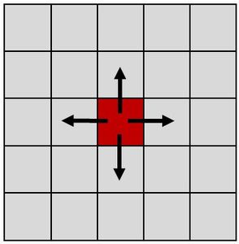
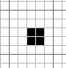
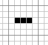
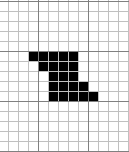
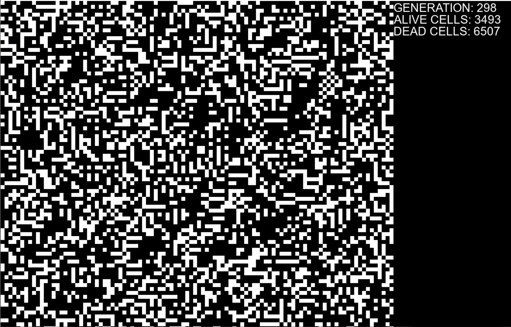
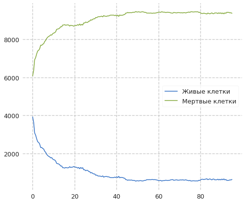
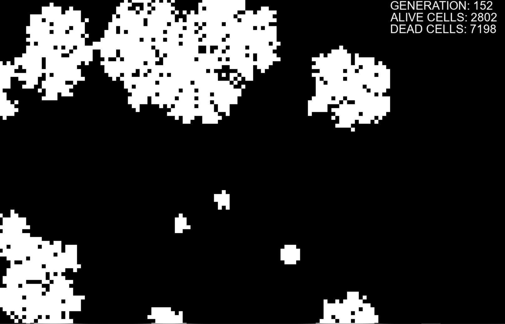
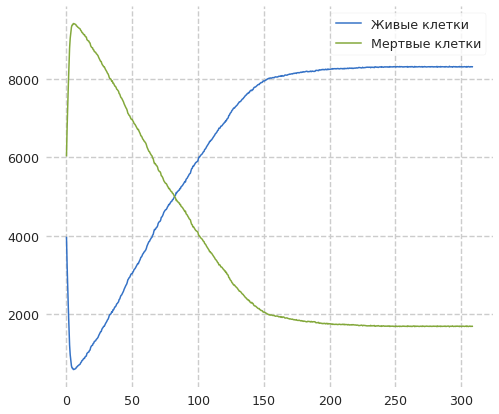
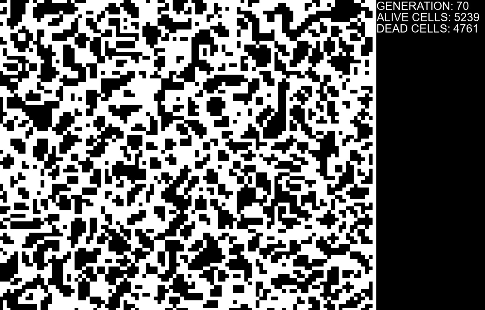
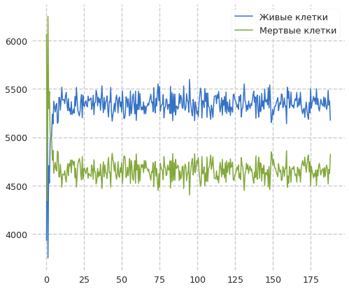

---
title: "Анализ сложных систем с помощью моделей клеточных автоматов"
author: [Доборщук Владимир Владимирович]
institute: "RUDN University, Moscow, Russian Federation"
subtitle: "c/б 1032186063 | НФИбд-01-18"
keywords: [Моделирование, Лабораторная]
lang: "ru"
toc-title: "Содержание"
toc: true # Table of contents
toc_depth: 2
lof: true # List of figures
fontsize: 12pt
mainfont: PT Serif
romanfont: PT Serif
sansfont: PT Sans
monofont: Fira Sans
mainfontoptions: Ligatures=TeX
romanfontoptions: Ligatures=TeX
sansfontoptions: Ligatures=TeX,Scale=MatchLowercase
monofontoptions: Scale=MatchLowercase
titlepage: true
titlepage-text-color: "000000"
titlepage-rule-color: "1A1B35"
titlepage-rule-height: 2
listings-no-page-break: true
indent: true
header-includes:
  - \usepackage{sectsty}
  - \sectionfont{\clearpage}
  - \linepenalty=10 # the penalty added to the badness of each line within a paragraph (no associated penalty node) Increasing the value makes tex try to have fewer lines in the paragraph.
  - \interlinepenalty=0 # value of the penalty (node) added after each line of a paragraph.
  - \hyphenpenalty=50 # the penalty for line breaking at an automatically inserted hyphen
  - \exhyphenpenalty=50 # the penalty for line breaking at an explicit hyphen
  - \binoppenalty=700 # the penalty for breaking a line at a binary operator
  - \relpenalty=500 # the penalty for breaking a line at a relation
  - \clubpenalty=150 # extra penalty for breaking after first line of a paragraph
  - \widowpenalty=150 # extra penalty for breaking before last line of a paragraph
  - \displaywidowpenalty=50 # extra penalty for breaking before last line before a display math
  - \brokenpenalty=100 # extra penalty for page breaking after a hyphenated line
  - \predisplaypenalty=10000 # penalty for breaking before a display
  - \postdisplaypenalty=0 # penalty for breaking after a display
  - \floatingpenalty = 20000 # penalty for splitting an insertion (can only be split footnote in standard LaTeX)
  - \raggedbottom # or \flushbottom
  - \usepackage{float} # keep figures where there are in the text
  - \floatplacement{figure}{H} # keep figures where there are in the text
...

# Теоретическое введение

## Общее определение

Клеточный автомат — дискретная модель, изучаемая в математике, теории вычислимости, физике, теоретической биологии и микромеханике. Включает регулярную решётку ячеек, каждая из которых может находиться в одном из конечного множества состояний, таких как 1 и 0. Решетка может быть любой размерности. Для каждой ячейки определено множество ячеек, называемых соседством. К примеру, соседство может быть определено как все ячейки на расстоянии не более 2 от текущей. Для работы клеточного автомата требуется задание начального состояния всех ячеек, и правил перехода ячеек из одного состояния в другое. На каждой итерации, используя правила перехода и состояния соседних ячеек, определяется новое состояние каждой ячейки. Обычно правила перехода одинаковы для всех ячеек и применяются сразу ко всей решётке (рис. 1).

Клеточный автомат является математическим объектом с дискретными пространством и временем. Каждое положение в пространстве представлено отдельной клеткой, а каждый момент времени - дискретным временным шагом или поколением. Состояние каждого пространственного локуса или клетки определяется очень простыми правилами взаимодействия. Эти правила предписывают изменения состояния каждой клетки в следующем такте времени в ответ на текущее состояние соседних клеток. Впервые, идея таких автоматов отмечена в работах Неймана в 1940-х годах, когда он работал над идеей саморепродуцирующихся машин. Вплоть до конца 60-х идея клеточных автоматов была забыта и лишь в 1970 Джон Конвей, математик Кембриджского университета, описал ныне широко известный двумерный клеточный автомат, названный "Игра жизни" ("Game of life").

## Математическая составляющая клеточных автоматов

Клеточный автомат можно определить как множество конечных автоматов, каждый из которых может находиться в одном из состояний $\sigma \in \sum \equiv \left\{0, 1, 2, \ldots, k-1, k\right\}$.

Изменение состояний автоматов происходит согласно правилу перехода $\sigma_{i,j}(t+1) = \varphi(\sigma_{k,l}(t) | \sigma_{k,l}(t) \in N)$, где $N$ - множество автоматов, составляющих соседство. К примеру, соседство фон Неймана определяется как $N^1_n(i,j) = \left\{\sigma_{k,l}(t) | |i - k| + |j - l| \le 1 \right\}$, а соседство Мура $N^1_m(i,j) = \left\{\sigma_{k,l}(t) | |i - k| \le 1, |j - l| \le 1\right\}$.

Число всех возможных правил перехода определяется числом состояний $\sigma$ и количеством соседей $p$ и составляет $N_r = \sigma^{\sigma^p}$.

# Игра жизни

Игра разыгрывается на двумерном массиве во избежание краевого эффекта, свернутом в тор. Каждая клетка может быть в одном из двух состояний: клетка может быть "живой" (на экране - черной) или "мертвой" (на экране - белой). Если клетка в текущем моменте времени жива, то в следующем такте времени она будет жива в лишь в том случае, если две или три из восьми соседних клеток живы в текущем такте  времени. В противном случае, клетка погибает. Если клетка мертва, то в следующем такте времени она оживает если и только если ровно 3 соседние клетки живы в текущем такте времени. В противном случае клетка остается мертвой. Если в качестве начального состояния установить случайное распределение живых имертвых клеток, запустить модель и проследить за ее эволюцией, то можно увидеть следующее. Часть структур:

- стабилизируются и не изменяются во времени (рис. 2) 

- претерпевают циклические изменения (рис. 3)

- развиваются, не повторяясь, практически неограниченное время (рис. 4)

Эти модусы поведения структур в клеточном автомате соответствуют в дифференциальных уравнениях фиксированной точке, предельному циклу и хаосу. Таким образом, клеточные автоматы представляют альтернативный дифференциальным уравнениям путь анализа поведения сложных систем. Поскольку пространственная подразделенность является имманентным свойством клеточных автоматов, то они сильны именно там, где дифференциальные уравнения малоэффективны или неприменимы. Нет другого способа узнать эволюцию начальной конфигурации в Игре жизнь, чем реализовать игру.

Правила игры задают только поведение отдельной клетки среди ближайших соседей. Однако имеем, что в игровой клеточной среде без какого-либо изначального предписания возникают устойчивые явления более высокого порядка. Жизнь отдельных клеток, которые строго привязаны к своим позициям, порождает устойчивые возмущения в среде, называемые паттернами. Возмущения могут быть статичными, находится в состоянии осцилляции либо проявлять более сложное поведение. Например, двигаться и сталкиваться, коллапсируя или порождая новые образования с причудливыми свойствами.

Такие свойства или явления, которые не были явно заданы изначально, но возникающие в результате процессов взаимодействия исходных составляющих, называются эмерджентными (дословно, возникающими). Эти свойства создаются и поддерживаются процессами внутри среды. Как только процессы исчезают – свойства также исчезают, как исчезает жизнь если разобрать организм на составляющие, а потом механически попытаться собрать воедино.
Эмерджентные свойства – неотъемлемая особенность сложных систем.

# Клеточные автоматы Стивена Вольфрама

Вольфрам провел эксперименты с самым простым вариантом игры жизнь, в котором среда представляет собой длинную замкнутую ленту шириной в одну клетку. Им двигала идея, что если нельзя понять, что происходит в этом самом простом клеточном автомате, то о более сложных системах и нечего думать.

Правила просты. Клетка может быть живой либо мертвой в зависимости от своего прежнего состояния и состояния двух её соседей. Итого, последующее состояние клетки определяется тремя параметрами. Из возможных состояний 3 ячеек можно составить лишь 8 возможных комбинаций.

Каждая комбинация может переводить клетку в одно из 2 возможных состояний (вкл. и выкл.) Итого получается небольшое конечное число возможных правил: 256 ($2^8$).
На каждом правиле Вольфрам провел серию экспериментов с различными начальными данными и в результате выделил 4 класса правил:

1. Почти все начальные конфигурации усавливаютантся в один и тот же финальный паттерн
2. Почти все начальные конфигурации устанавливаются в один и тот же финальный паттерн или циркулируют между несколькими финальными паттернами
3. Большинство начальных конфигураций создают выглядящее случайным поведение, а также порождают треугольники или другие регулярные структуры
4. Последний класс объединяет порядок и случайность, порождая локализованные структуры, которые будучи простыми сами по себе, двигаются и взаимодействуют друг с другом очень сложным образом.

Класс 4 является самым интересным. Примером правила 4 класса может служить «правило 110».

Есть кое-что неожиданное в нём. Ученик Вольфрама Мэтью Кук доказал, что это правило является Тьюринг-полным. Иными словами – это простейшая известная на данный момент вычислительная модель.

Вольфрам высказал предположение, что некоторое подобное простое правило может лежать в основе всех законов природы. По его словам, мир представляет собой сложную систему, порожденную этим простым правилом на неком вселенском клеточном автомате от большого взрыва и до мгновения, когда вы читаете эти строки.

Это утверждение упирается в священные споры о том, является ли вселенная вычислимой или вычисление – это лишь ментальная модель, позволяющая нам описывать с некоторой точностью след от «чего-то происходящего как-то».

# Применение клеточных автоматов 

Вопрос о том, могут ли клеточные автоматы моделировать непосредственно законы физики, а не только общие феноменологические аспекты нашего мира, был вновь поставлен Э. Фредкином, который проявлял активность и в более традиционных областях исследований клеточных автоматов, и Т. Тоффоли. Основной целью настоящего исследования является формулировка компьютероподобных моделей в физике, сохраняющих информацию, а значит и одно из наиболее фундаментальных свойств микроскопической физики, а именно обратимость.
Модели, которые явным образом сводят макроскопические явления к точно определенным микроскопическим процессам, представляют наибольший методологический интерес, потому что они обладают огромной убедительностью и ясностью. Но для того, чтобы они вообще могли что-то нам сказать, в общем случае нет иного выхода, кроме непосредственной реализации предписаний этих моделей, на деле преодолевающей пропасть между микроскопическим и макроскопическим масштабами: имитаторы клеточных автоматов, способные обновлять состояния миллионов клеток за предельно короткое время, становятся незаменимыми инструментами.

Этот подход был использован для того, чтобы обеспечить предельно простые модели обычных дифференциальных уравнений физики, таких как уравнение теплопроводности, волновое уравнение и уравнение Навье — Стокса, которые могут мыслиться как предельные случаи исключительно простых процессов комбинаторной динамики. В частности, клеточные автоматы были созданы для того, чтобы дать точные модели динамики жидкостей, которые не только будят мысль, но и конкурентоспособны, по крайней мере, в некоторых обстоятельствах, с точки зрения их вычислительной эффективности.

Бурно развивающийся раздел теории динамических систем изучает возникновение хорошо описанных коллективных явлений — упорядочение, турбулентность, хаос, нарушение симметрии, фрактальность и др. в системах, состоящих из большого числа частиц, взаимодействующих друг с другом нелинейно; цели исследований и их математический аппарат здесь больше похожи на присущие макроскопической физике и материаловедению. Клеточные автоматы обеспечивают богатую и непрерывно растущую коллекцию типичных моделей, в которых эти явления могут быть изучены относительно легко.
Кроме того клеточные автоматы очень часто используют при решении задач алгоритмической разрешимости той или иной задачи.

# Моделирование игры жизни

С помощью программных средств, в виде специальных математических библиотек и языка Python, удалось реализовать несколько различных моделей поведения клеточного автомата.

Также для каждого автомата представлен также график количества живых/мертвых клеток.

## Первая модель

## Вторая модель

## Третья модель

# Заключение

- Клеточный автомат — дискретная модель, изучаемая в математике, теории вычислимости, физике, теоретической биологии и микромеханике;
- "Игра жизни" разыгрывается на двумерном массиве во избежание краевого эффекта, свернутом в тор. Каждая клетка может быть в одном из двух состояний: клетка может быть "живой" или "мертвой". Если клетка в текущем моменте времени жива, то в следующем такте времени она будет жива в лишь в том случае, если две или три из восьми соседних клеток живы в текущем такте  времени.
- Клеточные автоматы обеспечивают богатую и непрерывно растущую коллекцию типичных моделей, в которых естественные явления могут быть изучены относительно легко.
- Клеточные автоматы очень часто используют при решении задач алгоритмической разрешимости той или иной задачи.

# Список использованных источников

https://itmodeling.fandom.com/ru/wiki/Анализ_сложных_систем_с_помощью _моделей_клеточных_автоматов

https://habr.com/ru/post/273393/

http://neerc.ifmo.ru/wiki/index.php?title=Модели_клеточных_автоматов